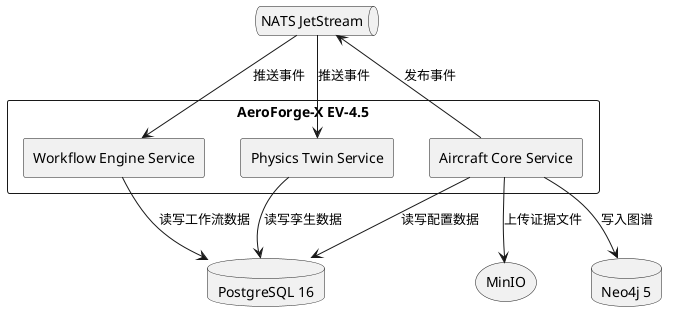
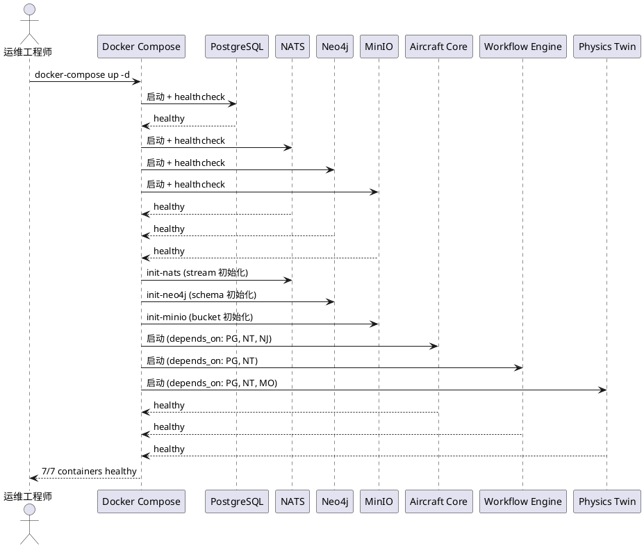
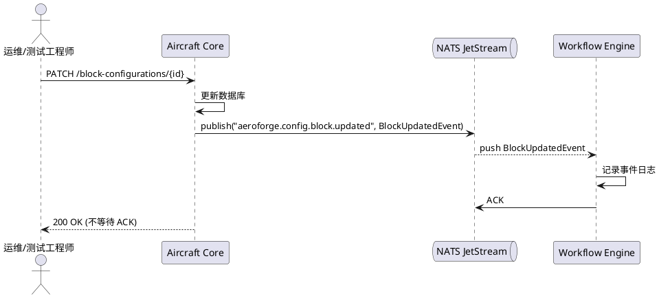
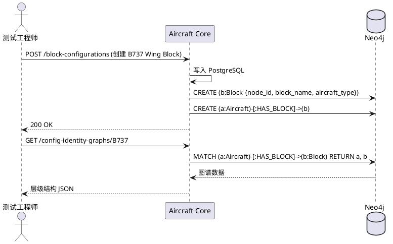
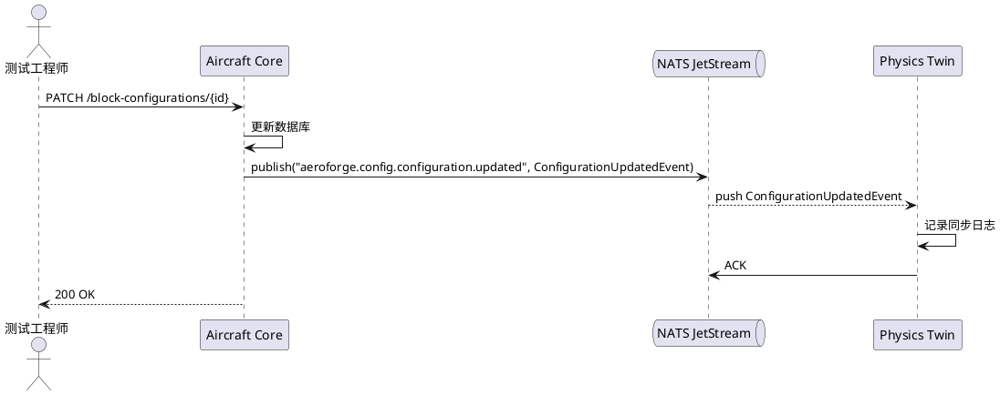

# AeroForge-X EV-4.5 Architecture Activation — 需求规格文档

**项目**: AeroForge-X v6.0 "Project Valkyrie"  
**Sprint**: EV-4.5 Architecture Activation  
**目标 TRL**: 5.5 → 6.0  
**日期**: 2026-06-22  
**状态**: DRAFT  

---

# 1. 组件定位

## 1.1 核心职责

本组件负责激活 AeroForge-X 多服务架构的全部核心基础设施，建立服务间事件驱动集成链路，将系统从单服务闭环升级为数字线程平台。

## 1.2 核心输入

1. **Docker Compose 编排配置**: 定义 7 个核心容器（postgres, aircraft-core, workflow-engine, physics-twin, nats, neo4j, minio）的启动依赖与健康检查
2. **NATS JetStream Stream 定义**: 事件流的 subject、retention、max_msgs 等配置
3. **Neo4j Schema 初始化脚本**: Configuration Identity Graph 的节点约束与关系类型定义
4. **MinIO Bucket 初始化配置**: 认证证据、数据集产物等存储桶定义
5. **Aircraft Core 配置变更事件**: `BlockUpdatedEvent`、`ConfigurationUpdatedEvent` 等事件数据
6. **认证证据文件**: PDF/CAD/NDT Report 等二进制文件上传请求

## 1.3 核心输出

1. **7 容器全部 healthy 的运行时环境**: 通过 `docker ps` 可验证
2. **NATS JetStream 事件传递**: Aircraft Core → NATS → Workflow Engine / Physics Twin 事件链路
3. **Neo4j Configuration Identity Graph**: B737 层级结构图谱数据，可通过 Cypher 查询
4. **MinIO 对象存储链路**: 文件上传 → URL 获取 → 下载成功的完整链路
5. **Physics Twin 同步链路**: Configuration Change → NATS → Physics Twin 事件接收

## 1.4 职责边界

- **不负责**：新增微服务或新增数据库（在现有 3 个 v2.0 服务中扩展）
- **不负责**：前端 UI 变更（EV-4.5 聚焦后端架构激活）
- **不负责**：生产级安全加固（认证鉴权、TLS、RBAC 属于 EV-5 范畴）
- **不负责**：性能调优与容量规划（本阶段验证可行性，不追求性能指标）
- **不负责**：TimescaleDB 激活（不在 EV-4.5 Sprint 范围内）

---

# 2. 领域术语

**Architecture Activation**
: 将已编写但未运行的基础设施组件（NATS、Neo4j、MinIO、Workflow Engine、Physics Twin）纳入 Docker Compose 编排并验证联合运行的过程。

**Digital Thread**
: 贯穿飞行器全生命周期的数据连续性链路，在本阶段体现为配置变更事件从 Aircraft Core 经 NATS 传递到下游服务的端到端链路。

**BlockUpdatedEvent**
: 当 Aircraft Core 中 Block Configuration 发生变更时发布到 NATS 的事件，包含 block_id、aircraft_type、变更内容、版本号等信息。

**ConfigurationUpdatedEvent**
: 当飞行器配置发生更新时发布到 NATS 的事件，用于通知 Physics Twin 进行同步，包含 configuration_id、change_type、timestamp 等信息。

**Configuration Identity Graph**
: 存储在 Neo4j 中的配置身份图谱，描述 Aircraft Type → Block → SN 的层级关系以及 Configuration Identity 节点之间的关联。

**Evidence Object**
: 存储在 MinIO 中的认证证据文件（PDF/CAD/NDT Report），通过预签名 URL 进行上传和下载。

**Sprint**
: EV-4.5 中的一次聚焦交付单元，分为 Sprint-A 到 Sprint-E 共 5 个子 Sprint，按依赖顺序执行。

**TRL (Technology Readiness Level)**
: 技术成熟度等级，EV-4.5 目标从 TRL 5.5 提升到 TRL 6.0，标志系统从单服务验证进入多服务联合验证。

---

# 3. 角色与边界

## 3.1 核心角色

- **系统运维工程师**: 负责执行 Docker Compose 编排、监控容器健康状态、排查启动故障
- **集成测试工程师**: 负责验证跨服务事件链路、图谱查询、对象存储等端到端功能

## 3.2 外部系统

- **Aircraft Core Service (FastAPI, port 8001)**: 配置管理核心服务，作为事件发布方和 Neo4j/MinIO 的写入方
- **Workflow Engine Service (FastAPI, port 8002)**: 工作流引擎，作为 NATS 事件消费方
- **Physics Twin Service (FastAPI, port 8003)**: 物理孪生服务，作为 NATS 事件消费方
- **NATS JetStream (port 4222/8222)**: 事件总线，承载服务间异步消息传递
- **Neo4j (port 7474/7687)**: 图数据库，存储 Configuration Identity Graph
- **MinIO (port 9000/9001)**: 对象存储，存储认证证据文件
- **PostgreSQL 16 (port 5432)**: 关系型数据库，三个服务共享

## 3.3 交互上下文



---

# 4. DFX约束

## 4.1 性能

- **EV4.5-NFR-01**: The system shall complete full Docker Compose bring-up (7 containers all healthy) within 120 seconds on the deployment server (8.210.239.214, Debian 13)
- **EV4.5-NFR-02**: The system shall deliver NATS event from publisher to subscriber within 2 seconds under no-load conditions
- **EV4.5-NFR-03**: The system shall complete Neo4j Cypher query (Configuration Identity Graph traversal) within 5 seconds for graphs with up to 100 nodes
- **EV4.5-NFR-04**: The system shall complete MinIO file upload (≤10MB) within 10 seconds on the deployment server

## 4.2 可靠性

- **EV4.5-NFR-05**: The system shall maintain all 7 containers in healthy state for at least 1 hour of continuous operation without manual intervention
- **EV4.5-NFR-06**: When a NATS JetStream stream is configured with `retention: limits` and `max_msgs: 100000`, the system shall not lose published events before consumer acknowledgment
- **EV4.5-NFR-07**: When Neo4j encounters a duplicate node_id insertion, the system shall reject the insertion and return an error without corrupting existing graph data

## 4.3 安全性

- **EV4.5-NFR-08**: The system shall not expose PostgreSQL, Neo4j, or MinIO management ports to public internet (only accessible within Docker network or via SSH tunnel)
- **EV4.5-NFR-09**: The system shall use environment variable injection for all database credentials, not hardcode secrets in Docker Compose files
- **EV4.5-NFR-10**: While MinIO is in EV-4.5 validation mode, the system shall use the default credentials with a documented plan for production hardening in EV-5

## 4.4 可维护性

- **EV4.5-NFR-11**: The system shall expose `/health` endpoints on all 3 FastAPI services (aircraft-core:8001, workflow-engine:8002, physics-twin:8003) returning JSON with `status` and `version` fields
- **EV4.5-NFR-12**: The system shall output structured logs (JSON format) from all 3 FastAPI services to stdout for Docker log collection
- **EV4.5-NFR-13**: The system shall provide a single `docker-compose.ev45.yml` file that brings up the complete EV-4.5 stack with one `docker-compose up` command

## 4.5 兼容性

- **EV4.5-NFR-14**: The system shall preserve all EV-4 API endpoints and behaviors without regression (React → FastAPI → PostgreSQL single-service loop remains functional)
- **EV4.5-NFR-15**: The system shall use the existing `EventBus` class in `aircraft-core-service/src/infrastructure/event_bus.py` for NATS integration, not introduce a new event bus implementation
- **EV4.5-NFR-16**: The system shall use the existing `docker-compose.v61.yml` as the base template for EV-4.5 Docker Compose configuration

---

# 5. 核心能力

## 5.1 Sprint-A: Infrastructure Bring-up

### 5.1.1 业务规则

1. **统一容器编排**: The system shall define a single Docker Compose file (`docker-compose.ev45.yml`) that declares all 7 core containers with proper dependency ordering and health checks

   a. 验收条件: [执行 `docker-compose -f docker-compose.ev45.yml up -d`] → [7 个容器全部启动且状态为 healthy]

2. **容器启动依赖链**: The system shall enforce the following startup dependency order: postgres → (nats, neo4j, minio) → init containers → (aircraft-core, workflow-engine, physics-twin)

   a. 验收条件: [启动完整栈] → [aircraft-core 在 postgres、neo4j、nats 均 healthy 后才启动]

3. **Init 容器幂等性**: The system shall ensure init containers (init-nats, init-minio, init-neo4j) are idempotent — re-running them shall not cause errors or data loss

   a. 验收条件: [重复执行 init 容器] → [无错误输出，现有数据不变]

4. **健康检查覆盖**: The system shall define health checks for all 7 containers using appropriate protocols (pg_isready for postgres, HTTP healthz for nats, HTTP /health for FastAPI services, HTTP /minio/health/live for minio, HTTP :7474 for neo4j)

   a. 验收条件: [`docker ps` 输出] → [7 个容器的 STATUS 列均显示 healthy]

5. **禁止项**: The system shall NOT include TimescaleDB container in EV-4.5 Docker Compose

   a. 验收条件: [`docker-compose.ev45.yml` 文件内容] → [不包含 timescaledb service 定义]

### 5.1.2 交互流程



### 5.1.3 异常场景

1. **容器启动失败**

   a. 触发条件: [某个容器在 start_period + retries 超时后仍未 healthy]
   
   b. 系统行为: [Docker Compose 标记该容器为 unhealthy，依赖该容器的下游服务不启动]
   
   c. 用户感知: [`docker ps` 显示 unhealthy 状态，`docker logs <container>` 显示错误详情]

2. **Init 容器执行失败**

   a. 触发条件: [init-nats / init-minio / init-neo4j 执行脚本报错退出]
   
   b. 系统行为: [依赖该 init 容器的服务因 `condition: service_completed_successfully` 不满足而阻塞]
   
   c. 用户感知: [下游服务容器状态为 Waiting，`docker logs <init-container>` 显示具体错误]

3. **端口冲突**

   a. 触发条件: [宿主机 5432/4222/7474/9000/8001/8002/8003 端口已被占用]
   
   b. 系统行为: [Docker Compose 启动时报端口绑定错误]
   
   c. 用户感知: [启动失败，错误信息包含 "port is already allocated"]

---

## 5.2 Sprint-B: NATS JetStream Event Bus

### 5.2.1 业务规则

1. **BlockUpdatedEvent 发布**: When Aircraft Core 完成一个 Block Configuration 的 PATCH 更新操作, the Aircraft Core Service shall 发布 `BlockUpdatedEvent` 到 NATS JetStream subject `aeroforge.config.block.updated`

   a. 验收条件: [通过 API `PATCH /block-configurations/{block_id}` 更新 Block] → [NATS subject `aeroforge.config.block.updated` 收到包含 block_id、version、updated_at 的事件消息]

2. **BlockUpdatedEvent 消费**: When Workflow Engine 收到 `BlockUpdatedEvent`, the Workflow Engine Service shall 记录事件日志（包含 event_id、block_id、received_at）并返回 ACK

   a. 验收条件: [Aircraft Core 发布 BlockUpdatedEvent] → [Workflow Engine 日志输出包含 block_id 和 received_at 的消费记录]

3. **事件数据结构**: The system shall 确保 `BlockUpdatedEvent` 包含以下字段: `event_id` (UUID), `event_type` ("BlockUpdated"), `block_id`, `aircraft_type`, `version`, `changed_fields`, `timestamp` (ISO 8601)

   a. 验收条件: [检查 NATS 消息 payload] → [包含所有规定字段且类型正确]

4. **JetStream Stream 配置**: The system shall 在 NATS JetStream 中创建名为 `AEROFORGE_CONFIG` 的 stream，配置 `subjects: ["aeroforge.config.>"]`, `retention: limits`, `max_msgs: 100000`, `max_age: 168h`

   a. 验收条件: [查询 NATS JetStream stream 信息] → [AEROFORGE_CONFIG stream 存在且配置匹配]

5. **Consumer 持久订阅**: The system shall 为 Workflow Engine 创建名为 `workflow-engine-config-consumer` 的 durable consumer，订阅 `aeroforge.config.>` subject

   a. 验收条件: [查询 NATS consumer 信息] → [durable consumer 存在且绑定到 AEROFORGE_CONFIG stream]

6. **禁止项**: The system shall NOT 要求事件消费方同步处理事件 — 所有消费必须为异步

   a. 验收条件: [Aircraft Core PATCH 响应时间] → [不受 Workflow Engine 消费处理时间影响]

### 5.2.2 交互流程



### 5.2.3 异常场景

1. **NATS 连接失败**

   a. 触发条件: [Aircraft Core 启动时 NATS 不可达]
   
   b. 系统行为: [Aircraft Core 的 EventBus 连接失败，记录 WARNING 日志，服务仍可正常启动并处理 HTTP 请求（事件发布为 no-op）]
   
   c. 用户感知: [服务 healthy 但日志包含 "NATS library not available, event_bus disabled" 或 "connection refused"]

2. **事件消费超时**

   a. 触发条件: [Workflow Engine 在 ACK 超时时间内未完成事件处理]
   
   b. 系统行为: [NATS JetStream 重发该消息（redelivery），直到收到 ACK 或达到 max_deliver 上限]
   
   c. 用户感知: [Workflow Engine 日志出现重复事件消费记录]

3. **事件 payload 格式错误**

   a. 触发条件: [发布的事件 JSON 缺少必填字段或类型不匹配]
   
   b. 系统行为: [消费方记录错误日志，发送 NACK，消息进入 NATS dead-letter 处理]
   
   c. 用户感知: [Workflow Engine 日志包含 payload 解析错误信息]

---

## 5.3 Sprint-C: Neo4j Configuration Identity Graph

### 5.3.1 业务规则

1. **Configuration Identity 节点创建**: When Aircraft Core 创建一个新的 Block Configuration, the Aircraft Core Service shall 在 Neo4j 中创建对应的 Configuration Identity 节点，包含 `node_id`、`block_name`、`aircraft_type` 属性

   a. 验收条件: [通过 API `POST /block-configurations` 创建 Block] → [Neo4j 中存在对应节点且属性匹配]

2. **层级关系建立**: The system shall 在 Neo4j 中建立 Aircraft Type → Block → SN 的层级关系，使用 `HAS_BLOCK` 和 `HAS_SN` 关系类型

   a. 验收条件: [Cypher `MATCH (a:Aircraft {aircraft_type: 'B737'})-[:HAS_BLOCK]->(b:Block)-[:HAS_SN]->(s:SN) RETURN a,b,s`] → [返回 B737 的完整层级结构]

3. **B737 种子数据**: The system shall 在 Neo4j 初始化时加载 B737 的种子图谱数据，包含 B737 → Wing / Fuselage / Engine 等至少 3 个 Block 节点

   a. 验收条件: [Cypher `MATCH (a:Aircraft {aircraft_type: 'B737'})-[:HAS_BLOCK]->(b:Block) RETURN count(b)`] → [返回值 ≥ 3]

4. **图谱查询 API**: The system shall 提供 REST API 端点用于查询 Configuration Identity Graph，返回指定 aircraft_type 的层级结构

   a. 验收条件: [GET 请求图谱查询端点，指定 aircraft_type=B737] → [返回包含 Aircraft → Block → SN 层级关系的 JSON]

5. **节点唯一性约束**: The system shall 在 Neo4j 中为 Configuration Identity 节点创建唯一性约束，防止重复插入

   a. 验收条件: [尝试插入相同 node_id 的 Configuration Identity 节点] → [Neo4j 返回 ConstraintViolation 错误]

6. **禁止项**: The system shall NOT 在 EV-4.5 阶段实现 Requirements Traceability Graph 和 Material Lot Traceability Graph 的数据写入 — 仅确保 schema 约束已创建

   a. 验收条件: [Neo4j 中存在 Requirement、DesignElement 等节点的 UNIQUE 约束] → [但无业务数据写入]

### 5.3.2 交互流程



### 5.3.3 异常场景

1. **Neo4j 连接失败**

   a. 触发条件: [Aircraft Core 启动时 Neo4j 不可达]
   
   b. 系统行为: [Aircraft Core 记录 WARNING 日志，Neo4j 写入操作降级为 no-op，HTTP 请求仍可正常处理]
   
   c. 用户感知: [服务 healthy 但图谱查询端点返回 503 Service Unavailable]

2. **约束冲突**

   a. 触发条件: [尝试创建已存在的 node_id 节点]
   
   b. 系统行为: [Neo4j 拒绝写入并返回 ConstraintViolation 错误]
   
   c. 用户感知: [API 返回 409 Conflict，提示节点已存在]

3. **图谱查询返回空结果**

   a. 触发条件: [查询不存在的 aircraft_type 的图谱数据]
   
   b. 系统行为: [返回空数组，HTTP 200]
   
   c. 用户感知: [响应体为空层级结构，无报错]

---

## 5.4 Sprint-D: MinIO Object Storage

### 5.4.1 业务规则

1. **证据文件上传**: When 用户通过 API 上传认证证据文件（PDF/CAD/NDT Report）, the Aircraft Core Service shall 将文件存储到 MinIO 的 `aeroforge-cert-evidence` bucket，并返回文件的唯一标识和访问 URL

   a. 验收条件: [POST 请求上传端点，附带文件] → [MinIO `aeroforge-cert-evidence` bucket 中存在该文件，API 返回 file_id 和 URL]

2. **预签名 URL 获取**: When 用户请求获取证据文件的下载链接, the system shall 生成 MinIO 预签名 URL（有效期 ≥ 1 小时）

   a. 验收条件: [GET 请求文件 URL 端点] → [返回可用的预签名 URL，通过该 URL 可成功下载文件]

3. **文件下载**: When 用户通过预签名 URL 下载证据文件, the system shall 返回完整的文件内容，Content-Type 与上传时一致

   a. 验收条件: [使用预签名 URL 发起 HTTP GET] → [返回文件内容，字节数与上传文件一致]

4. **Bucket 自动初始化**: The system shall 在 Docker Compose 启动时自动创建以下 MinIO buckets: `aeroforge-cert-evidence`, `aeroforge-dataset-artifacts`, `aeroforge-mdo-results`, `aeroforge-phm-models`, `aeroforge-uq-reports`, `aeroforge-gdt-annotations`, `aeroforge-export-packages`, `aeroforge-backups`

   a. 验收条件: [`docker-compose up` 完成后，`mc ls aeroforge/` 列出所有 8 个 bucket]

5. **文件大小限制**: The system shall 限制单次上传文件大小不超过 50MB

   a. 验收条件: [上传 51MB 文件] → [API 返回 413 Payload Too Large]

6. **禁止项**: The system shall NOT 在 EV-4.5 阶段实现文件版本管理和删除功能

   a. 验收条件: [API 不暴露 DELETE 端点] → [文件仅支持上传和下载]

### 5.4.2 交互流程

```plantuml
@startuml
actor "测试工程师" as OP
participant "Aircraft Core" as AC
storage "MinIO" as MO

OP -> AC : POST /evidence/upload (file: NDT_Report.pdf)
AC -> MO : putObject("aeroforge-cert-evidence", file_id, file_bytes)
MO --> AC : etag
AC -> AC : 记录 file_id + metadata
AC --> OP : { file_id, url }

OP -> AC : GET /evidence/{file_id}/url
AC -> MO : presignedGetObject("aeroforge-cert-evidence", file_id, expires=3600)
MO --> AC : presigned_url
AC --> OP : { url: presigned_url }

OP -> MO : GET presigned_url
MO --> OP : NDT_Report.pdf (binary)
@enduml
```

### 5.4.3 异常场景

1. **MinIO 连接失败**

   a. 触发条件: [Aircraft Core 启动时 MinIO 不可达]
   
   b. 系统行为: [Aircraft Core 记录 WARNING 日志，文件上传端点返回 503 Service Unavailable]
   
   c. 用户感知: [上传请求返回 503 错误，提示对象存储不可用]

2. **文件不存在**

   a. 触发条件: [请求获取不存在的 file_id 的 URL]
   
   b. 系统行为: [MinIO 返回 NoSuchKey 错误]
   
   c. 用户感知: [API 返回 404 Not Found]

3. **预签名 URL 过期**

   a. 触发条件: [使用已过期的预签名 URL 下载文件]
   
   b. 系统行为: [MinIO 返回 Access Denied]
   
   c. 用户感知: [下载请求返回 403 Forbidden，需重新获取 URL]

4. **不支持的文件类型**

   a. 触发条件: [上传 .exe 或 .sh 等可执行文件]
   
   b. 系统行为: [API 拒绝上传，返回 415 Unsupported Media Type]
   
   c. 用户感知: [错误提示"不支持的文件类型"]

---

## 5.5 Sprint-E: Physics Twin Activation

### 5.5.1 业务规则

1. **ConfigurationUpdatedEvent 发布**: When Aircraft Core 的 Block Configuration 发生变更, the Aircraft Core Service shall 发布 `ConfigurationUpdatedEvent` 到 NATS JetStream subject `aeroforge.config.configuration.updated`

   a. 验收条件: [PATCH /block-configurations/{block_id} 成功] → [NATS subject `aeroforge.config.configuration.updated` 收到包含 configuration_id、change_type、timestamp 的事件]

2. **Physics Twin 事件消费**: When Physics Twin Service 收到 `ConfigurationUpdatedEvent`, the Physics Twin Service shall 记录同步日志（包含 configuration_id、change_type、received_at）并返回 ACK

   a. 验收条件: [Aircraft Core 发布 ConfigurationUpdatedEvent] → [Physics Twin 日志输出包含 configuration_id 和 received_at 的同步记录]

3. **事件数据结构**: The system shall 确保 `ConfigurationUpdatedEvent` 包含以下字段: `event_id` (UUID), `event_type` ("ConfigurationUpdated"), `configuration_id`, `block_id`, `aircraft_type`, `change_type` (枚举: "CREATED"/"UPDATED"/"DELETED"), `timestamp` (ISO 8601)

   a. 验收条件: [检查 NATS 消息 payload] → [包含所有规定字段且 change_type 为枚举值之一]

4. **Consumer 持久订阅**: The system shall 为 Physics Twin 创建名为 `physics-twin-config-consumer` 的 durable consumer，订阅 `aeroforge.config.configuration.updated` subject

   a. 验收条件: [查询 NATS consumer 信息] → [durable consumer 存在且绑定到 AEROFORGE_CONFIG stream]

5. **同步链路端到端验证**: The system shall 提供验证端点或日志，证明配置变更事件从 Aircraft Core 经 NATS 到达 Physics Twin 的完整链路

   a. 验收条件: [Aircraft Core PATCH Block] → [Physics Twin 日志记录 ConfigurationUpdatedEvent 接收] → [端到端延迟 < 5 秒]

6. **禁止项**: The system shall NOT 在 EV-4.5 阶段实现 Physics Twin 的实际物理模型同步计算 — 仅验证事件接收和日志记录

   a. 验收条件: [Physics Twin 收到事件后] → [仅记录日志，不触发仿真计算]

### 5.5.2 交互流程



### 5.5.3 异常场景

1. **Physics Twin 启动时 NATS 不可达**

   a. 触发条件: [Physics Twin 启动时 NATS 连接失败]
   
   b. 系统行为: [Physics Twin 记录 WARNING 日志，事件订阅不生效，HTTP 请求仍可正常处理]
   
   c. 用户感知: [服务 healthy 但无法接收配置变更事件]

2. **事件消费失败**

   a. 触发条件: [Physics Twin 处理 ConfigurationUpdatedEvent 时抛出异常]
   
   b. 系统行为: [NACK 消息，NATS 重发，Physics Twin 记录错误日志]
   
   c. 用户感知: [Physics Twin 日志包含事件处理错误信息，可能看到重复消费记录]

3. **事件乱序**

   a. 触发条件: [同一 Block 短时间内多次变更，事件到达顺序与发布顺序不一致]
   
   b. 系统行为: [Physics Twin 按到达顺序处理，记录事件序号和时间戳用于排查]
   
   c. 用户感知: [日志中可见事件序号，但最终状态以最后一次处理为准]

---

# 6. 数据约束

## 6.1 BlockUpdatedEvent

1. **event_id**: 必填，UUID v4 格式，全局唯一
2. **event_type**: 必填，固定值 "BlockUpdated"
3. **block_id**: 必填，与 PostgreSQL block_configurations.id 对应
4. **aircraft_type**: 必填，非空字符串，如 "B737"
5. **version**: 必填，正整数，与 PostgreSQL block_configurations.version 对应
6. **changed_fields**: 必填，字符串数组，记录本次变更的字段名列表
7. **timestamp**: 必填，ISO 8601 格式（如 "2026-06-22T14:30:00Z"）

## 6.2 ConfigurationUpdatedEvent

1. **event_id**: 必填，UUID v4 格式，全局唯一
2. **event_type**: 必填，固定值 "ConfigurationUpdated"
3. **configuration_id**: 必填，UUID 格式，与 Configuration Identity 节点对应
4. **block_id**: 必填，与 PostgreSQL block_configurations.id 对应
5. **aircraft_type**: 必填，非空字符串
6. **change_type**: 必填，枚举值之一: "CREATED", "UPDATED", "DELETED"
7. **timestamp**: 必填，ISO 8601 格式

## 6.3 Configuration Identity Node (Neo4j)

1. **node_id**: 必填，UUID 格式，全局唯一（UNIQUE 约束）
2. **block_name**: 必填，非空字符串，如 "Wing", "Fuselage", "Engine"
3. **aircraft_type**: 必填，非空字符串，如 "B737"
4. **configuration_type**: 必填，枚举值之一: "Design", "Manufacturing", "Operational"
5. **version**: 可选，正整数，默认 1

## 6.4 Evidence Object (MinIO)

1. **file_id**: 必填，UUID 格式，全局唯一
2. **bucket**: 必填，必须为预定义 bucket 之一（如 `aeroforge-cert-evidence`）
3. **file_name**: 必填，非空字符串，包含文件扩展名
4. **content_type**: 必填，MIME 类型，支持: application/pdf, image/dwg, application/octet-stream
5. **file_size**: 必填，正整数，单位字节，最大 52428800 (50MB)
6. **upload_timestamp**: 必填，ISO 8601 格式

---

# 7. 验收矩阵

## 7.1 A级验收（必须通过）

| 需求编号 | 验收项 | 对应 Sprint |
|----------|--------|-------------|
| EV4.5-REQ-01 | NATS 启动且 healthy | Sprint-A |
| EV4.5-REQ-02 | Neo4j 启动且 healthy | Sprint-A |
| EV4.5-REQ-03 | MinIO 启动且 healthy | Sprint-A |
| EV4.5-REQ-04 | Workflow Engine 启动且 healthy | Sprint-A |
| EV4.5-REQ-05 | Physics Twin 启动且 healthy | Sprint-A |
| EV4.5-REQ-06 | Aircraft Core 发布 BlockUpdatedEvent 到 NATS | Sprint-B |
| EV4.5-REQ-07 | Workflow Engine 消费 BlockUpdatedEvent 并记录日志 | Sprint-B |
| EV4.5-REQ-08 | Neo4j 写入 Configuration Identity 节点 | Sprint-C |
| EV4.5-REQ-09 | Cypher MATCH 查询返回 B737 图谱数据 | Sprint-C |
| EV4.5-REQ-10 | MinIO 上传证据文件成功 | Sprint-D |
| EV4.5-REQ-11 | MinIO 获取预签名 URL 并下载成功 | Sprint-D |

## 7.2 A+级验收（目标达成）

| 需求编号 | 验收项 | 对应 Sprint |
|----------|--------|-------------|
| EV4.5-REQ-12 | Configuration Change → NATS → Workflow Engine 完整链路验证 | Sprint-B |
| EV4.5-REQ-13 | Configuration Change → NATS → Physics Twin 完整链路验证 | Sprint-E |
| EV4.5-REQ-14 | Evidence Upload → MinIO 完整链路验证 | Sprint-D |
| EV4.5-REQ-15 | Identity Link → Neo4j 完整链路验证 | Sprint-C |
| EV4.5-REQ-16 | 7 容器连续运行 1 小时无故障 | Sprint-A |

## 7.3 Sprint 验收命令

### Sprint-A 验收
```bash
# 在部署服务器上执行
docker ps --format "table {{.Names}}\t{{.Status}}" | grep aeroforge
# 预期: 7 个容器全部显示 healthy
```

### Sprint-B 验收
```bash
# 1. 触发配置变更
curl -X PATCH http://localhost:8001/api/v6/aircraft-core/block-configurations/{block_id} \
  -H "Content-Type: application/json" \
  -d '{"block_name": "Wing-Updated", "expected_version": 1}'

# 2. 检查 Workflow Engine 日志
docker logs aeroforge-workflow-engine 2>&1 | grep "BlockUpdated"
# 预期: 日志包含 BlockUpdatedEvent 消费记录
```

### Sprint-C 验收
```bash
# 通过 Aircraft Core API 查询图谱
curl http://localhost:8001/api/v6/aircraft-core/config-identity-graphs/B737
# 预期: 返回 B737 层级结构 JSON

# 或直接查询 Neo4j
docker exec aeroforge-neo4j cypher-shell -u neo4j -p aeroforge_neo4j \
  "MATCH (a:Aircraft {aircraft_type: 'B737'})-[:HAS_BLOCK]->(b:Block) RETURN a, b"
# 预期: 返回 B737 → Wing/Fuselage/Engine 图谱数据
```

### Sprint-D 验收
```bash
# 1. 上传文件
curl -X POST http://localhost:8001/api/v6/aircraft-core/evidence/upload \
  -F "file=@test_ndt_report.pdf" \
  -F "bucket=aeroforge-cert-evidence"
# 预期: 返回 file_id 和 url

# 2. 下载文件
curl -o downloaded.pdf "{presigned_url}"
# 预期: 下载成功，文件内容一致
```

### Sprint-E 验收
```bash
# 1. 触发配置变更
curl -X PATCH http://localhost:8001/api/v6/aircraft-core/block-configurations/{block_id} \
  -H "Content-Type: application/json" \
  -d '{"block_name": "Wing-V2", "expected_version": 2}'

# 2. 检查 Physics Twin 日志
docker logs aeroforge-physics-twin 2>&1 | grep "ConfigurationUpdated"
# 预期: 日志包含 ConfigurationUpdatedEvent 接收记录
```

---

# 8. Sprint 依赖与执行顺序

```
Sprint-A (Infrastructure Bring-up)
    │
    ├──→ Sprint-B (NATS Event Bus)
    │       │
    │       └──→ Sprint-E (Physics Twin Activation)
    │
    ├──→ Sprint-C (Neo4j Identity Graph)
    │
    └──→ Sprint-D (MinIO Object Storage)
```

- Sprint-A 是所有后续 Sprint 的前置条件
- Sprint-B 和 Sprint-E 有顺序依赖（先验证基础事件链路，再验证 Twin 同步）
- Sprint-C 和 Sprint-D 相互独立，可与 Sprint-B 并行开发