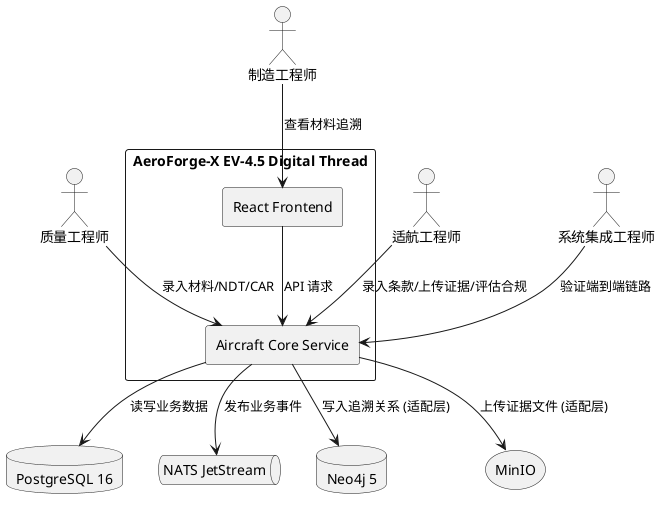
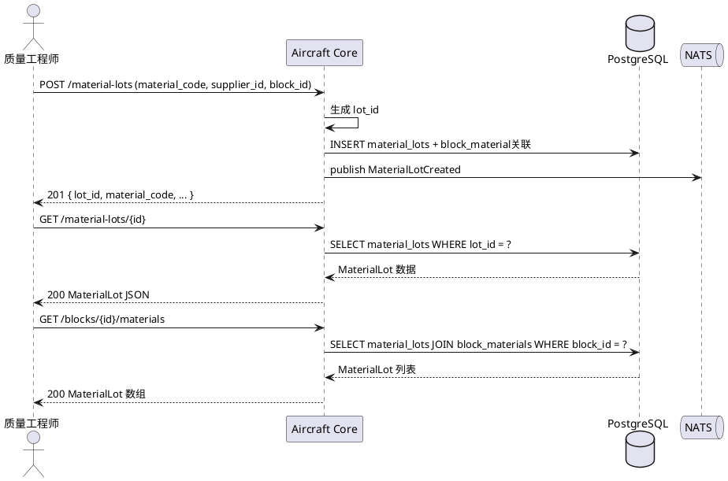
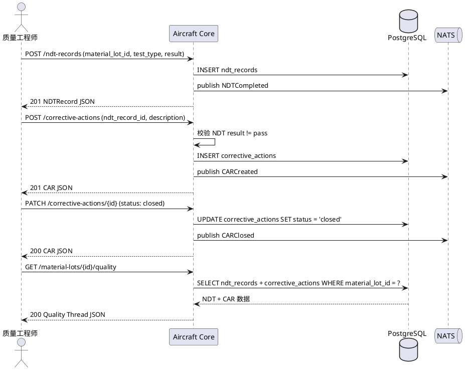
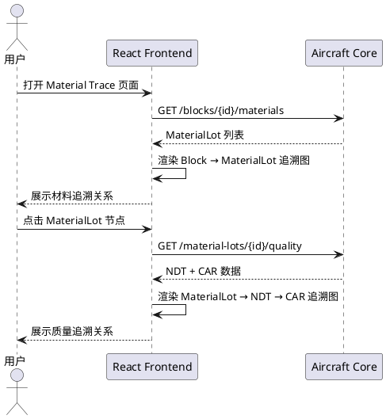
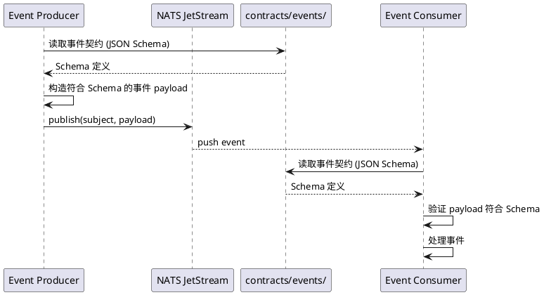
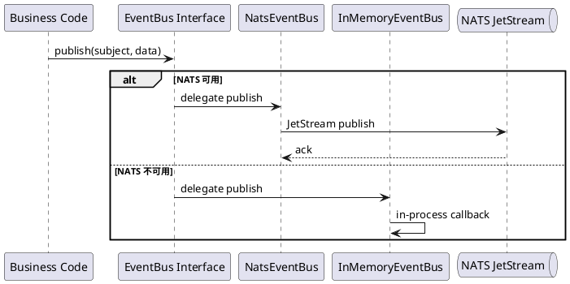
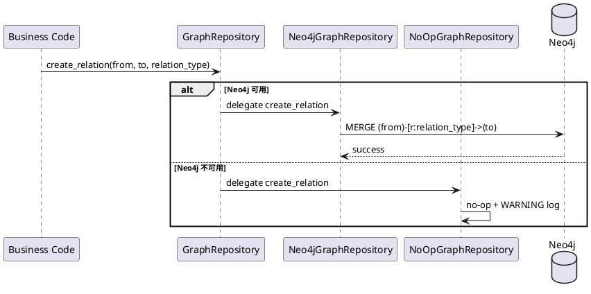
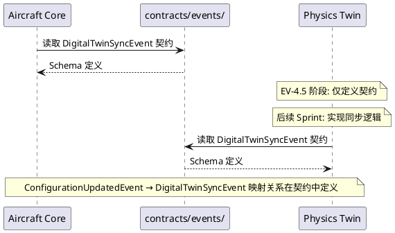

# AeroForge-X EV-4.5 Digital Thread Foundation — 需求规格文档

**项目**: AeroForge-X v6.0 "Project Valkyrie"  
**Sprint**: EV-4.5 Digital Thread Foundation Sprint  
**目标 TRL**: 6.0 → 6.5  
**日期**: 2026-06-22  
**状态**: DRAFT  
**前置基线**: EV-4.5 Architecture Activation（7 容器 healthy，NATS/Neo4j/MinIO 已部署验证）  
**核心原则**: 业务驱动，不是技术驱动

---

# 1. 组件定位

## 1.1 核心职责

本组件负责建立 AeroForge-X 飞机数字线程（Aircraft Digital Thread）的三条业务主线——Material Thread、Quality Thread、Certification Thread——以及配套的前端追溯页面和基础设施适配层，实现从需求到适航的全生命周期可追溯。

## 1.2 核心输入

1. **MaterialLot 数据**: 材料批次信息（lot_id, material_code, supplier_id, certificate_no 等），由用户通过 API 录入
2. **NDT Record 数据**: 无损检测结果数据（material_lot_id, test_type, result, inspector 等），由质量工程师录入
3. **CAR 数据**: 纠正措施请求数据（ndt_record_id, description, status, responsible_person 等），由质量工程师录入
4. **Certification Evidence 文件**: 适航认证证据文件（PDF/CAD/NDT Report），通过 MinIO 上传
5. **Compliance Requirement 数据**: 适航条款信息（requirement_id, regulation, description 等），由适航工程师录入
6. **Block Configuration 变更事件**: Aircraft Core 已有的 BlockUpdatedEvent 和 ConfigurationUpdatedEvent
7. **EV-4.5 Architecture Activation 已部署基础设施**: 7 容器 healthy 运行环境，NATS JetStream / Neo4j / MinIO 已验证

## 1.3 核心输出

1. **Material Thread 完整链路**: Block → MaterialLot 关联关系，支持材料批次创建、查询、关联 Block
2. **Quality Thread 完整链路**: MaterialLot → NDTRecord → CAR 关系链，支持质量追溯查询
3. **Certification Thread 完整链路**: Requirement → Evidence → Compliance 关系，支持适航合规查询
4. **React 数字线程追溯页面**: 4 个 Trace 页面（Configuration / Material / Quality / Certification）
5. **事件契约定义**: 6 个业务事件的正式契约文件（contracts/events/ 目录）
6. **基础设施适配层**: EventBus / ObjectStorage / GraphRepository 抽象接口与实现
7. **Physics Twin 同步契约**: DigitalTwinSyncEvent 定义（仅契约，禁止仿真/AI/CFD/FEA/PINN/MDO）

## 1.4 职责边界

- **不负责**: 新增微服务或新增数据库（所有新代码在 aircraft-core-service 中扩展）
- **不负责**: Physics Twin 的实际仿真计算、CFD/FEA/MDO/PINN/AI 仿真、结构计算、气动分析
- **不负责**: 生产级安全加固（认证鉴权、TLS、RBAC 属于 EV-5 范畴）
- **不负责**: 数据迁移和 ETL 流程
- **不负责**: 外部系统集成（ERP/MES/PLM 接口属于后续 Sprint）
- **不负责**: 为了 Neo4j 而 Neo4j、为了 NATS 而 NATS、为了 MinIO 而 MinIO——基础设施仅在业务需要时引入

---

# 2. 领域术语

**Digital Thread（数字线程）**
: 贯穿飞行器全生命周期的数据连续性链路，体现为 需求 → 设计 → 制造 → 验证 → 适航 → 运营 的可追溯关系链。

**Material Thread（材料线程）**
: 数字线程的制造阶段子链路，追踪 Block → MaterialLot 的材料来源关系，回答"这个部件用了什么材料、来自哪个供应商"。

**Quality Thread（质量线程）**
: 数字线程的验证阶段子链路，追踪 MaterialLot → NDTRecord → CAR 的质量检测和整改关系，回答"这批材料检测结果如何、发现了什么问题、如何整改"。

**Certification Thread（适航线程）**
: 数字线程的适航阶段子链路，追踪 Requirement → Evidence → Compliance 的适航合规关系，回答"这个条款的证据是什么、合规状态如何"。

**MaterialLot（材料批次）**
: 从供应商接收的一批同规格材料，具有唯一的 lot_id、material_code、supplier_id、certificate_no，状态包括 received/inspected/accepted/rejected/quarantined。

**NDT Record（无损检测记录）**
: 对材料批次执行无损检测（超声波/射线/渗透等）的结果记录，关联到具体 MaterialLot，检测结果为 pass/fail/conditional。

**CAR（Corrective Action Request，纠正措施请求）**
: 当 NDT 检测发现不合格项时发起的纠正措施请求，包含问题描述、责任人、状态（open/in_progress/closed），关联到具体 NDT Record。

**Compliance（合规记录）**
: 适航条款与证据之间的合规判定记录，包含合规状态（compliant/non_compliant/partial/pending）、责任人、更新时间。

**Evidence（证据对象）**
: 存储在 MinIO 中的适航认证证据文件（PDF/CAD/NDT Report），通过预签名 URL 进行上传和下载，关联到具体的适航条款。

**Event Contract（事件契约）**
: 定义事件的数据结构、发布条件、消费语义的正式规范文件，存放于 contracts/events/ 目录，确保事件生产者和消费者的解耦。

**DigitalTwinSyncEvent（数字孪生同步事件）**
: 定义配置变更同步到数字孪生的契约事件，包含 aircraft_id、block_id、version、timestamp、change_type，仅定义契约不实现仿真。

---

# 3. 角色与边界

## 3.1 核心角色

- **质量工程师**: 负责录入材料批次信息、NDT 检测结果、发起和关闭 CAR
- **适航工程师**: 负责录入适航条款、上传认证证据、评估合规状态
- **制造工程师**: 负责查看 Block 与 MaterialLot 的关联关系，追溯材料来源
- **系统集成工程师**: 负责验证端到端数字线程链路，确认全生命周期可追溯

## 3.2 外部系统

- **Aircraft Core Service (FastAPI, port 8001)**: 配置管理核心服务，扩展 Material/Quality/Certification 业务逻辑
- **React Frontend (port 80)**: 数字线程追溯页面，通过 nginx 反向代理访问 Aircraft Core API
- **PostgreSQL 16 (port 5432)**: 关系型数据库，新增 material_lots / ndt_records / corrective_actions / compliance_requirements / evidences 表
- **NATS JetStream (port 4222/8222)**: 事件总线，新增 MaterialLotCreated / NDTCompleted / CARCreated / CARClosed / EvidenceUploaded 事件
- **Neo4j 5 (port 7474/7687)**: 图数据库，通过适配层写入 Material/Quality/Certification 关系
- **MinIO (port 9000/9001)**: 对象存储，服务于 Certification Evidence 文件上传下载

## 3.3 交互上下文



---

# 4. DFX约束

## 4.1 性能

- **DT-NFR-01**: The system shall complete MaterialLot creation API (POST /material-lots) within 500 milliseconds under normal load
- **DT-NFR-02**: The system shall complete Quality Thread query (GET /material-lots/{id}/quality) within 2 seconds for a MaterialLot with up to 10 NDT records and 5 CARs
- **DT-NFR-03**: The system shall complete Certification Thread query (GET /compliance/{requirement}) within 3 seconds for a requirement with up to 20 evidence items
- **DT-NFR-04**: The system shall complete React Trace page initial load within 3 seconds on the deployment server (8.210.239.214:6000)
- **DT-NFR-05**: The system shall complete Digital Thread end-to-end trace query (Aircraft → Material → Quality → Certification) within 5 seconds

## 4.2 可靠性

- **DT-NFR-06**: When any infrastructure component (NATS/Neo4j/MinIO) is unavailable, the Aircraft Core Service shall continue to serve all HTTP API requests with degraded functionality (no-op for infrastructure operations)
- **DT-NFR-07**: The system shall ensure all business events published to NATS JetStream are persisted and available for at least 168 hours (7 days) with retention policy
- **DT-NFR-08**: The system shall maintain referential integrity between MaterialLot, NDTRecord, and CAR records — deleting a MaterialLot with associated NDT records shall be rejected

## 4.3 安全性

- **DT-NFR-09**: The system shall not expose PostgreSQL, Neo4j, or MinIO management ports to public internet (only accessible within Docker network or via SSH tunnel)
- **DT-NFR-10**: The system shall validate all API input data using Pydantic V2 models before processing, rejecting malformed requests with 422 status code
- **DT-NFR-11**: While MinIO is in EV-4.5 validation mode, the system shall restrict file uploads to allowed MIME types only (application/pdf, image/*, model/step, application/octet-stream)

## 4.4 可维护性

- **DT-NFR-12**: The system shall expose all new API endpoints under the existing `/api/v6/aircraft-core` prefix with consistent response format
- **DT-NFR-13**: The system shall output structured logs (JSON format) for all Digital Thread operations including event publish/consume, material lot creation, NDT record creation
- **DT-NFR-14**: The system shall define event contracts as versioned JSON Schema files in `contracts/events/` directory, enabling independent consumer evolution
- **DT-NFR-15**: The system shall implement all infrastructure integrations (NATS/Neo4j/MinIO) behind abstract interfaces (EventBus/ObjectStorage/GraphRepository), allowing implementation swapping without business code changes

## 4.5 兼容性

- **DT-NFR-16**: The system shall preserve all EV-4 API endpoints and EV-4.5 Architecture Activation endpoints without regression
- **DT-NFR-17**: The system shall use the existing PostgreSQL database (aeroforge) for all new tables, not create additional databases
- **DT-NFR-18**: The system shall use the existing docker-compose.ev45.yml infrastructure, not add new containers or services

---

# 5. 核心能力

## 5.1 Sprint-DT01: Material Thread

### 5.1.1 业务规则

1. **DT-REQ-01**: When 用户通过 API 提交材料批次信息, the Aircraft Core Service shall 创建 MaterialLot 记录并持久化到 PostgreSQL，包含 lot_id、material_code、material_name、supplier_id、manufacture_date、received_date、certificate_no、status 字段

   a. 验收条件: [POST /material-lots 请求包含完整字段] → [PostgreSQL material_lots 表新增一条记录，status 默认为 "received"]

2. **DT-REQ-02**: When 用户查询指定 MaterialLot, the Aircraft Core Service shall 返回该材料批次的完整信息

   a. 验收条件: [GET /material-lots/{id} 请求] → [返回包含所有字段的 MaterialLot JSON，HTTP 200]

3. **DT-REQ-03**: When 用户查询指定 Block 关联的材料批次, the Aircraft Core Service shall 返回该 Block 下所有关联的 MaterialLot 列表

   a. 验收条件: [GET /blocks/{id}/materials 请求] → [返回 MaterialLot 数组，包含与该 Block 关联的所有材料批次]

4. **DT-REQ-04**: When 创建 MaterialLot 并关联到 Block, the Aircraft Core Service shall 建立 Block → MaterialLot 的关联关系，并发布 MaterialLotCreated 事件到 NATS

   a. 验收条件: [POST /material-lots 请求包含 block_id 关联字段] → [PostgreSQL 中存在 Block-MaterialLot 关联记录；NATS subject `aeroforge.material.lot.created` 收到事件]

5. **DT-REQ-05**: When 创建 MaterialLot, the system shall 自动生成唯一 lot_id（格式: {material_code}-{sequence}），不允许用户手动指定 lot_id

   a. 验收条件: [POST /material-lots 请求] → [返回的 lot_id 为系统自动生成，格式如 "AL-2024-001"]

6. **DT-REQ-06**: When 用户提交的 MaterialLot 数据缺少必填字段, the Aircraft Core Service shall 拒绝创建并返回 422 Validation Error

   a. 验收条件: [POST /material-lots 请求缺少 material_code] → [返回 HTTP 422，错误信息包含缺失字段名]

7. **禁止项**: The system shall NOT 在 Material Thread 中实现材料批次的删除功能

   a. 验收条件: [API 端点列表] → [不存在 DELETE /material-lots/{id} 端点]

### 5.1.2 交互流程



### 5.1.3 异常场景

1. **MaterialLot 查询不存在**

   a. 触发条件: [GET /material-lots/{id} 请求的 id 不存在]
   
   b. 系统行为: [返回 HTTP 404 Not Found]
   
   c. 用户感知: [错误提示 "MaterialLot not found"]

2. **Block 关联查询无结果**

   a. 触发条件: [GET /blocks/{id}/materials 请求的 Block 没有关联材料批次]
   
   b. 系统行为: [返回空数组，HTTP 200]
   
   c. 用户感知: [响应体为空数组 `[]`，无报错]

3. **NATS 发布失败**

   a. 触发条件: [MaterialLot 创建成功但 NATS 不可用]
   
   b. 系统行为: [事件发布降级为 no-op，记录 WARNING 日志，HTTP 响应仍为 201]
   
   c. 用户感知: [MaterialLot 创建成功，但下游服务无法感知新批次]

---

## 5.2 Sprint-DT02: Quality Thread

### 5.2.1 业务规则

1. **DT-REQ-07**: When 用户为指定 MaterialLot 提交 NDT 检测记录, the Aircraft Core Service shall 创建 NDTRecord 并关联到该 MaterialLot，同时发布 NDTCompleted 事件到 NATS

   a. 验收条件: [POST /ndt-records 请求包含 material_lot_id 和检测数据] → [PostgreSQL ndt_records 表新增记录；NATS subject `aeroforge.quality.ndt.completed` 收到事件]

2. **DT-REQ-08**: When NDT 检测结果为 fail 或 conditional, the Aircraft Core Service shall 允许用户为该 NDT Record 创建 CAR（纠正措施请求）

   a. 验收条件: [POST /corrective-actions 请求包含 ndt_record_id 且对应 NDT 结果为 fail] → [CAR 创建成功，status 为 "open"]

3. **DT-REQ-09**: When 用户关闭一个 CAR, the Aircraft Core Service shall 将 CAR 状态更新为 "closed"，并发布 CARClosed 事件到 NATS

   a. 验收条件: [PATCH /corrective-actions/{id} 请求将 status 更新为 "closed"] → [CAR 状态更新；NATS subject `aeroforge.quality.car.closed` 收到事件]

4. **DT-REQ-10**: When 用户查询指定 MaterialLot 的质量信息, the Aircraft Core Service shall 返回该材料批次关联的所有 NDT 记录和 CAR 的完整链路

   a. 验收条件: [GET /material-lots/{id}/quality 请求] → [返回包含 NDTRecord 列表和嵌套 CAR 列表的 JSON，形成 MaterialLot → NDT → CAR 完整链路]

5. **DT-REQ-11**: When 用户创建 CAR 时, the system shall 发布 CARCreated 事件到 NATS

   a. 验收条件: [POST /corrective-actions 请求] → [NATS subject `aeroforge.quality.car.created` 收到事件]

6. **DT-REQ-12**: When 用户为 pass 结果的 NDT Record 创建 CAR, the Aircraft Core Service shall 拒绝创建并返回业务校验错误

   a. 验收条件: [POST /corrective-actions 请求中 ndt_record_id 对应的 NDT 结果为 pass] → [返回 HTTP 400，错误提示 "CAR can only be created for failed or conditional NDT results"]

7. **禁止项**: The system shall NOT 在 Quality Thread 中实现 NDT 记录的修改和删除功能

   a. 验收条件: [API 端点列表] → [不存在 PUT/PATCH/DELETE /ndt-records 端点]

### 5.2.2 交互流程



### 5.2.3 异常场景

1. **NDT Record 关联不存在的 MaterialLot**

   a. 触发条件: [POST /ndt-records 请求中 material_lot_id 不存在]
   
   b. 系统行为: [返回 HTTP 404 Not Found]
   
   c. 用户感知: [错误提示 "MaterialLot not found"]

2. **CAR 关联不存在的 NDT Record**

   a. 触发条件: [POST /corrective-actions 请求中 ndt_record_id 不存在]
   
   b. 系统行为: [返回 HTTP 404 Not Found]
   
   c. 用户感知: [错误提示 "NDT Record not found"]

3. **关闭已关闭的 CAR**

   a. 触发条件: [PATCH /corrective-actions/{id} 请求将已 closed 的 CAR 再次关闭]
   
   b. 系统行为: [返回 HTTP 400 Bad Request]
   
   c. 用户感知: [错误提示 "CAR is already closed"]

4. **Quality Thread 查询无结果**

   a. 触发条件: [GET /material-lots/{id}/quality 请求的 MaterialLot 没有 NDT 记录]
   
   b. 系统行为: [返回空 NDT 数组，HTTP 200]
   
   c. 用户感知: [响应体中 ndt_records 为空数组]

---

## 5.3 Sprint-DT03: Certification Thread

### 5.3.1 业务规则

1. **DT-REQ-13**: When 用户查询指定适航条款的合规信息, the Aircraft Core Service shall 返回该条款关联的所有证据包、合规状态、责任人和更新时间

   a. 验收条件: [GET /compliance/{requirement} 请求，如 FAA-25.853] → [返回包含 evidence 列表、compliance_status、responsible_person、updated_at 的 JSON]

2. **DT-REQ-14**: When 用户上传认证证据文件, the Aircraft Core Service shall 将文件存储到 MinIO 的 `aeroforge-cert-evidence` bucket，创建 Evidence 记录关联到适航条款，并发布 EvidenceUploaded 事件到 NATS

   a. 验收条件: [POST /evidence/upload 请求包含文件和 requirement_id] → [MinIO 中存储文件；PostgreSQL evidences 表新增记录；NATS subject `aeroforge.cert.evidence.uploaded` 收到事件]

3. **DT-REQ-15**: When 用户查询指定证据文件, the Aircraft Core Service shall 返回证据文件的元数据和预签名下载 URL

   a. 验收条件: [GET /evidence/{id} 请求] → [返回包含 file_id、file_name、bucket、content_type、file_size、upload_timestamp、presigned_url 的 JSON]

4. **DT-REQ-16**: When 适航工程师更新合规状态, the Aircraft Core Service shall 更新 Compliance 记录的 compliance_status、responsible_person 和 updated_at 字段

   a. 验收条件: [PATCH /compliance/{requirement} 请求更新 compliance_status 为 "compliant"] → [Compliance 记录更新，updated_at 刷新]

5. **DT-REQ-17**: When 查询适航条款的合规信息且该条款尚无证据, the Aircraft Core Service shall 返回合规状态为 "pending" 的空证据列表

   a. 验收条件: [GET /compliance/{requirement} 请求的条款无关联证据] → [返回 compliance_status="pending"，evidence 列表为空]

6. **禁止项**: The system shall NOT 在 Certification Thread 中实现证据文件的删除功能

   a. 验收条件: [API 端点列表] → [不存在 DELETE /evidence/{id} 端点]

### 5.3.2 交互流程

```plantuml
@startuml
actor "适航工程师" as CE
participant "Aircraft Core" as AC
storage "MinIO" as MO
database "PostgreSQL" as PG
queue "NATS" as NT

CE -> AC : POST /evidence/upload (file, requirement_id)
AC -> MO : putObject("aeroforge-cert-evidence", file_id, file_bytes)
MO --> AC : etag
AC -> PG : INSERT evidences + compliance_evidence关联
AC -> NT : publish EvidenceUploaded
AC --> CE : 201 { file_id, url, ... }

CE -> AC : GET /evidence/{id}
AC -> PG : SELECT evidences WHERE id = ?
AC -> MO : presignedGetObject(file_id)
MO --> AC : presigned_url
AC --> CE : 200 Evidence JSON + URL

CE -> AC : GET /compliance/{requirement}
AC -> PG : SELECT compliance + evidences WHERE requirement_id = ?
PG --> AC : Compliance + Evidence 数据
AC --> CE : 200 Compliance JSON (含证据包+状态+责任人+更新时间)

CE -> AC : PATCH /compliance/{requirement} (status: compliant)
AC -> PG : UPDATE compliance SET status = 'compliant', updated_at = NOW()
AC --> CE : 200 Compliance JSON
@enduml
```

### 5.3.3 异常场景

1. **MinIO 上传失败**

   a. 触发条件: [POST /evidence/upload 请求时 MinIO 不可用]
   
   b. 系统行为: [返回 HTTP 503 Service Unavailable，不创建 Evidence 记录]
   
   c. 用户感知: [错误提示 "Object storage unavailable"]

2. **查询不存在的适航条款**

   a. 触发条件: [GET /compliance/{requirement} 请求的条款不存在]
   
   b. 系统行为: [创建 Compliance 记录（compliance_status="pending"），返回空证据列表]
   
   c. 用户感知: [返回 compliance_status="pending" 的默认合规记录]

3. **证据文件不存在**

   a. 触发条件: [GET /evidence/{id} 请求的 id 不存在]
   
   b. 系统行为: [返回 HTTP 404 Not Found]
   
   c. 用户感知: [错误提示 "Evidence not found"]

4. **不支持的文件类型**

   a. 触发条件: [上传 .exe 或 .sh 等可执行文件作为证据]
   
   b. 系统行为: [返回 HTTP 415 Unsupported Media Type]
   
   c. 用户感知: [错误提示 "Unsupported content type"]

---

## 5.4 Sprint-DT04: React 数字线程页面

### 5.4.1 业务规则

1. **DT-REQ-18**: When 用户打开 Configuration Trace 页面, the React Frontend shall 展示 Aircraft → Block → Version 的配置追溯层级结构

   a. 验收条件: [浏览器访问 Configuration Trace 页面] → [页面展示 B737 → MAIN-WING → v1 的配置层级树]

2. **DT-REQ-19**: When 用户打开 Material Trace 页面, the React Frontend shall 展示 Block → MaterialLot 的材料追溯关系

   a. 验收条件: [浏览器访问 Material Trace 页面，选择 Block B737-MAIN-WING] → [页面展示 AL-2024-001 材料批次信息]

3. **DT-REQ-20**: When 用户打开 Quality Trace 页面, the React Frontend shall 展示 MaterialLot → NDT → CAR 的质量追溯关系链

   a. 验收条件: [浏览器访问 Quality Trace 页面，选择 MaterialLot AL-2024-001] → [页面展示 NDT-001 检测记录和 CAR-001 纠正措施]

4. **DT-REQ-21**: When 用户打开 Certification Trace 页面, the React Frontend shall 展示 Requirement → Evidence → Compliance 的适航追溯关系链

   a. 验收条件: [浏览器访问 Certification Trace 页面，选择 FAA-25.853] → [页面展示证据包列表和合规状态]

5. **DT-REQ-22**: When 用户在 Trace 页面点击追溯链中的节点, the React Frontman shall 展示该节点的详细信息面板

   a. 验收条件: [点击 MaterialLot 节点 AL-2024-001] → [右侧面板展示 lot_id、material_code、supplier_id、certificate_no、status 等完整信息]

6. **DT-REQ-23**: When API 请求失败或返回空数据, the React Frontend shall 展示友好的空状态或错误提示，不显示空白页面

   a. 验收条件: [API 返回空数组] → [页面展示 "暂无数据" 空状态提示]

### 5.4.2 交互流程



### 5.4.3 异常场景

1. **后端 API 不可用**

   a. 触发条件: [React 前端请求 API 时 Aircraft Core 返回 5xx 或网络超时]
   
   b. 系统行为: [前端展示错误提示 "服务暂时不可用，请稍后重试"，提供重试按钮]
   
   c. 用户感知: [页面展示错误状态而非空白]

2. **追溯链断裂**

   a. 触发条件: [MaterialLot 存在但无关联 NDT 记录]
   
   b. 系统行为: [前端在 NDT 节点处展示 "未检测" 状态标识]
   
   c. 用户感知: [追溯链在 NDT 处显示灰色/虚线，标注 "未检测"]

---

## 5.5 Sprint-INF01: MinIO 接入

### 5.5.1 业务规则

1. **DT-REQ-24**: When Certification Evidence 文件需要存储, the Aircraft Core Service shall 通过 ObjectStorage 接口将文件存储到 MinIO，而非本地文件系统

   a. 验收条件: [POST /evidence/upload 请求] → [文件存储在 MinIO `aeroforge-cert-evidence` bucket，而非本地磁盘]

2. **DT-REQ-25**: When MinIO 不可用, the Aircraft Core Service shall 通过 ObjectStorage 接口的 LocalStorage 降级实现继续提供文件上传服务（存储到本地磁盘）

   a. 验收条件: [停止 MinIO 容器后上传证据文件] → [文件存储到本地磁盘，API 返回成功，日志记录降级模式 WARNING]

3. **DT-REQ-26**: When MinIO 恢复可用, the system shall 支持从 LocalStorage 切换回 MinIOStorage，不影响已上传文件的访问

   a. 验收条件: [重启 MinIO 容器后上传新证据文件] → [新文件存储到 MinIO，之前本地存储的文件仍可通过原 URL 访问]

4. **禁止项**: The system shall NOT 在 Certification Evidence 之外的场景使用 MinIO

   a. 验收条件: [代码审查] → [MinIO ObjectStorage 仅在 Certification Thread 的证据上传/下载流程中被调用]

### 5.5.2 交互流程

```plantuml
@startuml
actor "适航工程师" as CE
participant "Aircraft Core" as AC
participant "ObjectStorage" as OS
storage "MinIO" as MO
storage "LocalStorage" as LS

CE -> AC : POST /evidence/upload
AC -> OS : upload_file(bucket, file_data)
alt MinIO 可用
    OS -> MO : putObject()
    MO --> OS : etag
    OS --> AC : file_id + metadata
else MinIO 不可用
    OS -> LS : write to local disk
    LS --> OS : file_id + metadata
    OS --> AC : file_id + metadata (降级模式)
end
AC --> CE : 201 Evidence JSON
@enduml
```

### 5.5.3 异常场景

1. **MinIO 和 LocalStorage 均不可用**

   a. 触发条件: [MinIO 不可用且本地磁盘空间不足]
   
   b. 系统行为: [返回 HTTP 503 Service Unavailable]
   
   c. 用户感知: [错误提示 "文件存储服务不可用"]

---

## 5.6 Sprint-INF02: Event Contract

### 5.6.1 业务规则

1. **DT-REQ-27**: When 系统定义业务事件契约, the system shall 将所有事件契约以 JSON Schema 格式输出到 `contracts/events/` 目录

   a. 验收条件: [contracts/events/ 目录] → [包含 ConfigurationChanged.json、MaterialLotCreated.json、NDTCompleted.json、CARCreated.json、CARClosed.json、EvidenceUploaded.json 共 6 个契约文件]

2. **DT-REQ-28**: When 事件生产者发布事件, the event payload shall 符合对应事件契约的 JSON Schema 定义

   a. 验收条件: [使用 JSON Schema 验证器检查 NATS 上的事件 payload] → [所有事件均通过 Schema 验证]

3. **DT-REQ-29**: When 事件契约需要变更, the system shall 使用语义化版本号（major.minor.patch）管理契约版本，major 版本变更表示 breaking change

   a. 验收条件: [contracts/events/ 目录中每个契约文件] → [包含 version 字段，初始版本为 1.0.0]

4. **DT-REQ-30**: When 定义 ConfigurationChanged 事件契约, the system shall 包含 event_id (UUID)、event_type、configuration_id、block_id、aircraft_type、change_type (CREATED/UPDATED/DELETED)、timestamp 字段

   a. 验收条件: [ConfigurationChanged.json 契约文件] → [包含所有规定字段的 Schema 定义]

5. **DT-REQ-31**: When 定义 MaterialLotCreated 事件契约, the system shall 包含 event_id (UUID)、event_type、lot_id、material_code、supplier_id、block_id、timestamp 字段

   a. 验收条件: [MaterialLotCreated.json 契约文件] → [包含所有规定字段的 Schema 定义]

6. **DT-REQ-32**: When 定义 NDTCompleted 事件契约, the system shall 包含 event_id (UUID)、event_type、ndt_record_id、material_lot_id、test_type、result、timestamp 字段

   a. 验收条件: [NDTCompleted.json 契约文件] → [包含所有规定字段的 Schema 定义]

7. **DT-REQ-33**: When 定义 CARCreated 事件契约, the system shall 包含 event_id (UUID)、event_type、car_id、ndt_record_id、description、status、timestamp 字段

   a. 验收条件: [CARCreated.json 契约文件] → [包含所有规定字段的 Schema 定义]

8. **DT-REQ-34**: When 定义 CARClosed 事件契约, the system shall 包含 event_id (UUID)、event_type、car_id、closed_by、timestamp 字段

   a. 验收条件: [CARClosed.json 契约文件] → [包含所有规定字段的 Schema 定义]

9. **DT-REQ-35**: When 定义 EvidenceUploaded 事件契约, the system shall 包含 event_id (UUID)、event_type、evidence_id、requirement_id、file_id、file_name、timestamp 字段

   a. 验收条件: [EvidenceUploaded.json 契约文件] → [包含所有规定字段的 Schema 定义]

### 5.6.2 交互流程



### 5.6.3 异常场景

1. **事件 payload 不符合契约**

   a. 触发条件: [消费方收到的事件缺少必填字段或类型不匹配]
   
   b. 系统行为: [消费方记录错误日志，发送 NACK，事件进入重发队列]
   
   c. 用户感知: [日志包含 Schema 验证失败的详细信息]

---

## 5.7 Sprint-INF03: NATS 适配层

### 5.7.1 业务规则

1. **DT-REQ-36**: When 业务代码需要发布或订阅事件, the system shall 通过 EventBus 抽象接口（publish/subscribe 方法）进行操作，不直接依赖 NATS 客户端

   a. 验收条件: [业务代码中] → [不存在直接 import nats 或直接调用 nats 客户端的代码，所有事件操作通过 EventBus 接口]

2. **DT-REQ-37**: When NATS 不可用, the system shall 通过 InMemoryEventBus 实现提供事件总线的降级功能，确保业务逻辑不因基础设施不可用而中断

   a. 验收条件: [停止 NATS 容器后执行业务操作] → [业务操作正常完成，事件通过 InMemoryEventBus 在进程内传递]

3. **DT-REQ-38**: When NATS 可用, the system shall 通过 NatsEventBus 实现提供持久化事件传递，确保事件不丢失

   a. 验收条件: [NATS 正常运行时发布事件] → [事件持久化到 JetStream stream，消费方通过 durable consumer 可靠消费]

4. **DT-REQ-39**: When 系统启动, the Aircraft Core Service shall 根据配置自动选择 EventBus 实现（NATS 可用则 NatsEventBus，否则 InMemoryEventBus）

   a. 验收条件: [启动时 NATS 不可用] → [日志记录 "Using InMemoryEventBus (NATS unavailable)"；启动时 NATS 可用] → [日志记录 "Using NatsEventBus"]

5. **DT-REQ-40**: When EventBus 的 publish 或 subscribe 操作执行, the system shall 确保操作不阻塞业务请求的 HTTP 响应

   a. 验收条件: [PATCH /block-configurations 响应时间] → [不受 EventBus publish 耗时影响]

### 5.7.2 交互流程



### 5.7.3 异常场景

1. **NATS 运行中断连**

   a. 触发条件: [NatsEventBus 运行中 NATS 服务突然不可达]
   
   b. 系统行为: [publish 操作记录 WARNING 日志并返回（fire-and-forget），不抛出异常]
   
   c. 用户感知: [业务请求正常返回，但事件可能丢失]

2. **InMemoryEventBus 无持久化**

   a. 触发条件: [使用 InMemoryEventBus 时服务重启]
   
   b. 系统行为: [所有未消费的内存事件丢失]
   
   c. 用户感知: [服务重启后，之前发布的事件不可恢复]

---

## 5.8 Sprint-INF04: Neo4j 适配层

### 5.8.1 业务规则

1. **DT-REQ-41**: When 业务代码需要创建或查询追溯关系, the system shall 通过 GraphRepository 抽象接口（create_relation / find_relations 方法）进行操作，不直接依赖 Neo4j 客户端

   a. 验收条件: [业务代码中] → [不存在直接 import neo4j 或直接调用 Neo4j driver 的代码，所有图谱操作通过 GraphRepository 接口]

2. **DT-REQ-42**: When Neo4j 不可用, the system shall 通过 NoOpGraphRepository 实现提供图谱操作的降级功能，确保业务逻辑不因基础设施不可用而中断

   a. 验收条件: [停止 Neo4j 容器后执行业务操作] → [业务操作正常完成，GraphRepository 操作为 no-op，记录 WARNING 日志]

3. **DT-REQ-43**: When Neo4j 可用, the system shall 通过 Neo4jGraphRepository 实现提供持久化图谱存储和查询

   a. 验收条件: [Neo4j 正常运行时创建关系] → [关系持久化到 Neo4j，后续查询可返回结果]

4. **DT-REQ-44**: The system shall 禁止业务代码直接依赖 Neo4j——所有图谱操作必须通过 GraphRepository 接口

   a. 验收条件: [代码审查] → [业务层代码中不存在对 neo4j driver 的直接引用]

5. **禁止项**: The system shall NOT 在 GraphRepository 接口中暴露 Neo4j 特有的 Cypher 查询能力——接口方法必须是业务语义的（如 create_relation、find_relations）

   a. 验收条件: [GraphRepository 接口定义] → [不包含 execute_cypher 或类似底层查询方法]

### 5.8.2 交互流程



### 5.8.3 异常场景

1. **Neo4j 写入超时**

   a. 触发条件: [Neo4jGraphRepository 写入操作超过 5 秒未完成]
   
   b. 系统行为: [记录 WARNING 日志，返回 False，不阻塞业务请求]
   
   c. 用户感知: [业务请求正常返回，但图谱关系未写入]

2. **Neo4j 唯一性约束冲突**

   a. 触发条件: [尝试创建已存在的关系]
   
   b. 系统行为: [Neo4j MERGE 语句幂等处理，不报错]
   
   c. 用户感知: [操作成功，无重复数据]

---

## 5.9 Sprint-INF05: Physics Twin 契约

### 5.9.1 业务规则

1. **DT-REQ-45**: When 定义 DigitalTwinSyncEvent 契约, the system shall 包含 aircraft_id、block_id、version、timestamp、change_type 字段，输出到 contracts/events/DigitalTwinSyncEvent.json

   a. 验收条件: [contracts/events/DigitalTwinSyncEvent.json 文件] → [包含所有规定字段的 JSON Schema 定义]

2. **DT-REQ-46**: When ConfigurationUpdatedEvent 发布后, the system shall 能够将事件转换为 DigitalTwinSyncEvent 契约格式（仅定义转换映射，不实现实际同步逻辑）

   a. 验收条件: [contracts/events/ 目录中存在 DigitalTwinSyncEvent.json] → [字段映射文档说明 ConfigurationUpdatedEvent → DigitalTwinSyncEvent 的转换关系]

3. **禁止项**: The system shall NOT 在 EV-4.5 阶段开发任何 Physics Twin 的仿真计算能力，包括但不限于 CFD、FEA、MDO、PINN、AI 仿真、结构计算、气动分析

   a. 验收条件: [代码审查] → [physics-twin-service 中不存在仿真计算相关代码，仅存在事件接收和日志记录]

4. **禁止项**: The system shall NOT 在 EV-4.5 阶段扩展 Physics Twin 的功能范围——仅定义 DigitalTwinSyncEvent 契约

   a. 验收条件: [Sprint-INF05 交付物] → [仅包含 contracts/events/DigitalTwinSyncEvent.json 契约文件，不包含新的 Python 代码]

### 5.9.2 交互流程



### 5.9.3 异常场景

1. **契约定义不完整**

   a. 触发条件: [DigitalTwinSyncEvent.json 缺少必填字段定义]
   
   b. 系统行为: [JSON Schema 验证失败，构建流程报错]
   
   c. 用户感知: [CI/CD 流水线失败，提示 Schema 验证错误]

---

# 6. 数据约束

## 6.1 MaterialLot

1. **lot_id**: 必填，系统自动生成，格式 {material_code}-{sequence}，如 "AL-2024-001"，全局唯一
2. **material_code**: 必填，非空字符串，材料编码，如 "AL-2024"、"TI-6AL-4V"
3. **material_name**: 必填，非空字符串，材料名称，如 "Aluminum 2024-T3"、"Titanium Alloy"
4. **supplier_id**: 必填，非空字符串，供应商标识，如 "Supplier-A"、"Supplier-B"
5. **manufacture_date**: 必填，ISO 8601 日期格式，材料制造日期
6. **received_date**: 必填，ISO 8601 日期格式，材料接收日期
7. **certificate_no**: 必填，非空字符串，材料质量证书编号
8. **status**: 必填，枚举值之一: "received" / "inspected" / "accepted" / "rejected" / "quarantined"，默认 "received"

## 6.2 NDTRecord

1. **ndt_record_id**: 必填，系统自动生成，UUID 格式，全局唯一
2. **material_lot_id**: 必填，关联 MaterialLot.lot_id，外键约束
3. **test_type**: 必填，枚举值之一: "ultrasonic" / "radiographic" / "penetrant" / "magnetic_particle" / "eddy_current"
4. **result**: 必填，枚举值之一: "pass" / "fail" / "conditional"
5. **inspector**: 必填，非空字符串，检测人员标识
6. **test_date**: 必填，ISO 8601 日期格式，检测日期
7. **notes**: 可选，自由文本，检测备注

## 6.3 CorrectiveActionRequest (CAR)

1. **car_id**: 必填，系统自动生成，UUID 格式，全局唯一
2. **ndt_record_id**: 必填，关联 NDTRecord.ndt_record_id，外键约束，且对应 NDT result 必须为 "fail" 或 "conditional"
3. **description**: 必填，非空字符串，问题描述
4. **status**: 必填，枚举值之一: "open" / "in_progress" / "closed"，默认 "open"
5. **responsible_person**: 必填，非空字符串，责任人
6. **created_at**: 必填，ISO 8601 格式，创建时间，系统自动填充
7. **updated_at**: 必填，ISO 8601 格式，更新时间，系统自动维护
8. **closed_at**: 可选，ISO 8601 格式，关闭时间，仅 status="closed" 时有值

## 6.4 ComplianceRequirement

1. **requirement_id**: 必填，非空字符串，适航条款编号，如 "FAA-25.853"、"CCAR-25.853"，全局唯一
2. **regulation**: 必填，非空字符串，所属法规，如 "FAR-25"、"CCAR-25"
3. **description**: 必填，非空字符串，条款描述
4. **compliance_status**: 必填，枚举值之一: "compliant" / "non_compliant" / "partial" / "pending"，默认 "pending"
5. **responsible_person**: 可选，非空字符串，合规责任人
6. **updated_at**: 必填，ISO 8601 格式，更新时间

## 6.5 Evidence

1. **evidence_id**: 必填，UUID 格式，全局唯一
2. **requirement_id**: 必填，关联 ComplianceRequirement.requirement_id
3. **file_id**: 必填，UUID 格式，MinIO 中的对象 key
4. **file_name**: 必填，非空字符串，原始文件名
5. **bucket**: 必填，固定值 "aeroforge-cert-evidence"
6. **content_type**: 必填，MIME 类型
7. **file_size**: 必填，正整数，单位字节，最大 52428800 (50MB)
8. **upload_timestamp**: 必填，ISO 8601 格式

## 6.6 DigitalTwinSyncEvent

1. **aircraft_id**: 必填，非空字符串，飞行器标识，如 "B737-000001"
2. **block_id**: 必填，非空字符串，Block 标识
3. **version**: 必填，正整数，配置版本号
4. **timestamp**: 必填，ISO 8601 格式，事件时间戳
5. **change_type**: 必填，枚举值之一: "CREATED" / "UPDATED" / "DELETED"

---

# 7. 验收矩阵

## 7.1 PASS 级验收（必须通过）

| 需求编号 | 验收项 | 对应 Sprint |
|----------|--------|-------------|
| DT-REQ-01 | 创建 MaterialLot 并持久化到 PostgreSQL | Sprint-DT01 |
| DT-REQ-02 | 查询指定 MaterialLot 返回完整信息 | Sprint-DT01 |
| DT-REQ-03 | 查询 Block 关联的 MaterialLot 列表 | Sprint-DT01 |
| DT-REQ-07 | 创建 NDTRecord 并关联 MaterialLot | Sprint-DT02 |
| DT-REQ-10 | 查询 MaterialLot 的质量信息完整链路 | Sprint-DT02 |
| DT-REQ-13 | 查询适航条款的合规信息（证据包+状态+责任人+更新时间） | Sprint-DT03 |
| DT-REQ-15 | 查询证据文件元数据和预签名 URL | Sprint-DT03 |
| DT-REQ-18 | Configuration Trace 页面展示 Aircraft → Block → Version | Sprint-DT04 |
| DT-REQ-19 | Material Trace 页面展示 Block → MaterialLot | Sprint-DT04 |
| DT-REQ-20 | Quality Trace 页面展示 MaterialLot → NDT → CAR | Sprint-DT04 |
| DT-REQ-21 | Certification Trace 页面展示 Requirement → Evidence → Compliance | Sprint-DT04 |

## 7.2 A 级验收（PASS + 基础设施适配）

| 需求编号 | 验收项 | 对应 Sprint |
|----------|--------|-------------|
| DT-REQ-24 | Certification Evidence 文件存储到 MinIO | Sprint-INF01 |
| DT-REQ-25 | MinIO 不可用时降级到 LocalStorage | Sprint-INF01 |
| DT-REQ-27 | 6 个事件契约文件输出到 contracts/events/ | Sprint-INF02 |
| DT-REQ-28 | 事件 payload 符合 JSON Schema 契约 | Sprint-INF02 |
| DT-REQ-36 | 业务代码通过 EventBus 抽象接口操作 | Sprint-INF03 |
| DT-REQ-37 | InMemoryEventBus 降级实现 | Sprint-INF03 |
| DT-REQ-38 | NatsEventBus 持久化事件传递 | Sprint-INF03 |

## 7.3 A+ 级验收（A + 高级适配层）

| 需求编号 | 验收项 | 对应 Sprint |
|----------|--------|-------------|
| DT-REQ-41 | 业务代码通过 GraphRepository 抽象接口操作 | Sprint-INF04 |
| DT-REQ-42 | NoOpGraphRepository 降级实现 | Sprint-INF04 |
| DT-REQ-43 | Neo4jGraphRepository 持久化图谱操作 | Sprint-INF04 |
| DT-REQ-45 | DigitalTwinSyncEvent 契约定义 | Sprint-INF05 |

## 7.4 最终验收场景（必须演示）

```
B737-000001 → MAIN-WING → AL-2024-001 → Supplier-A → NDT-001 → CAR-001 → Evidence-Package → FAA Compliance
```

**端到端验收步骤**:

1. **Configuration Thread**: GET /config-hierarchies/B737 → 返回 B737-000001 → MAIN-WING 层级
2. **Material Thread**: POST /material-lots (material_code=AL-2024, block_id=B737-MAIN-WING) → 创建 AL-2024-001，关联 MAIN-WING
3. **Quality Thread**: POST /ndt-records (material_lot_id=AL-2024-001, result=conditional) → 创建 NDT-001
4. **Quality Thread**: POST /corrective-actions (ndt_record_id=NDT-001) → 创建 CAR-001
5. **Certification Thread**: POST /evidence/upload (file=NDT_Report.pdf, requirement_id=FAA-25.853) → 上传 Evidence-Package
6. **Certification Thread**: GET /compliance/FAA-25.853 → 返回证据包 + compliance_status + responsible_person + updated_at
7. **React Trace 页面**: 在 4 个 Trace 页面中可视化展示完整追溯链

**验收命令**:

```bash
# 1. 创建材料批次
curl -X POST http://localhost:8001/api/v6/aircraft-core/material-lots \
  -H "Content-Type: application/json" \
  -d '{"material_code": "AL-2024", "material_name": "Aluminum 2024-T3", "supplier_id": "Supplier-A", "block_id": "B737-MAIN-WING", "certificate_no": "CERT-2024-001"}'
# 预期: 201, lot_id = "AL-2024-001"

# 2. 查询 Block 关联材料
curl http://localhost:8001/api/v6/aircraft-core/blocks/B737-MAIN-WING/materials
# 预期: 200, 返回包含 AL-2024-001 的数组

# 3. 创建 NDT 记录
curl -X POST http://localhost:8001/api/v6/aircraft-core/ndt-records \
  -H "Content-Type: application/json" \
  -d '{"material_lot_id": "AL-2024-001", "test_type": "ultrasonic", "result": "conditional", "inspector": "Inspector-001"}'
# 预期: 201, ndt_record_id = "NDT-001"

# 4. 创建 CAR
curl -X POST http://localhost:8001/api/v6/aircraft-core/corrective-actions \
  -H "Content-Type: application/json" \
  -d '{"ndt_record_id": "NDT-001", "description": "Minor porosity detected", "responsible_person": "Engineer-001"}'
# 预期: 201, car_id = "CAR-001"

# 5. 查询质量链路
curl http://localhost:8001/api/v6/aircraft-core/material-lots/AL-2024-001/quality
# 预期: 200, 返回 MaterialLot → NDT → CAR 完整链路

# 6. 上传证据文件
curl -X POST http://localhost:8001/api/v6/aircraft-core/evidence/upload \
  -F "file=@ndt_report.pdf" \
  -F "requirement_id=FAA-25.853"
# 预期: 201, 返回 file_id

# 7. 查询适航合规
curl http://localhost:8001/api/v6/aircraft-core/compliance/FAA-25.853
# 预期: 200, 返回 evidence 列表 + compliance_status + responsible_person + updated_at

# 8. React Trace 页面验证
# 浏览器访问 http://8.210.239.214:6000/configuration-trace → 展示 B737 配置层级
# 浏览器访问 http://8.210.239.214:6000/material-trace → 展示 MAIN-WING → AL-2024-001
# 浏览器访问 http://8.210.239.214:6000/quality-trace → 展示 AL-2024-001 → NDT-001 → CAR-001
# 浏览器访问 http://8.210.239.214:6000/certification-trace → 展示 FAA-25.853 → Evidence → Compliance
```

---

# 8. Sprint 依赖与执行顺序

```
Sprint-DT01 (Material Thread) ──────── P1
    │
    ├──→ Sprint-DT02 (Quality Thread) ── P1
    │       │
    │       └──→ Sprint-DT03 (Certification Thread) ── P1
    │
    └──→ Sprint-DT04 (React Trace 页面) ── P1
            │
            └──→ 依赖 DT01/DT02/DT03 的 API

Sprint-INF01 (MinIO 接入) ──────────── P2 (依赖 DT03)
Sprint-INF02 (Event Contract) ──────── P2 (依赖 DT01/DT02)
Sprint-INF03 (NATS 适配层) ─────────── P2 (依赖 INF02)
Sprint-INF04 (Neo4j 适配层) ────────── P3 (独立)
Sprint-INF05 (Physics Twin 契约) ───── P3 (独立)
```

**执行顺序建议**:
1. DT01 → DT02 → DT03（业务主线，串行执行）
2. DT04（React 页面，在 DT01/DT02/DT03 API 就绪后开发）
3. INF01/INF02/INF03（基础设施适配，与 DT Sprint 并行）
4. INF04/INF05（低优先级适配层，最后执行）

---

# 9. 与 EV-4.5 Architecture Activation 的关系

本 Sprint 是 EV-4.5 Architecture Activation 的业务延续，复用已部署的基础设施：

| 已部署基础设施 | 本 Sprint 中的用途 | 引入时机 |
|---------------|-------------------|----------|
| NATS JetStream | 发布 MaterialLotCreated/NDTCompleted/CARCreated/CARClosed/EvidenceUploaded 事件 | Sprint-INF02/INF03 |
| Neo4j 5 | 通过 GraphRepository 适配层写入 Material/Quality/Certification 追溯关系 | Sprint-INF04 |
| MinIO | 通过 ObjectStorage 适配层存储 Certification Evidence 文件 | Sprint-INF01 |
| EventBus (publish_jetstream) | 升级为抽象接口 + 双实现（InMemoryEventBus / NatsEventBus） | Sprint-INF03 |
| Graph Client (graph_client.py) | 重构为 GraphRepository 抽象接口 + 双实现（NoOp / Neo4j） | Sprint-INF04 |
| Object Storage (object_storage.py) | 重构为 ObjectStorage 抽象接口 + 双实现（Local / MinIO） | Sprint-INF01 |

**核心原则验证**: 每个基础设施的引入都有明确的业务场景驱动——MinIO 服务于 Certification Evidence，Neo4j 服务于关系追踪，NATS 服务于 Digital Thread Event。