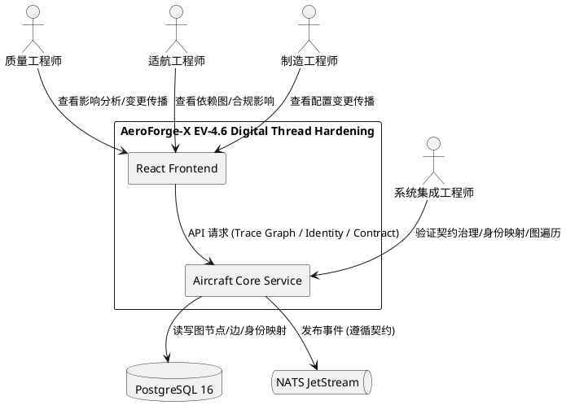
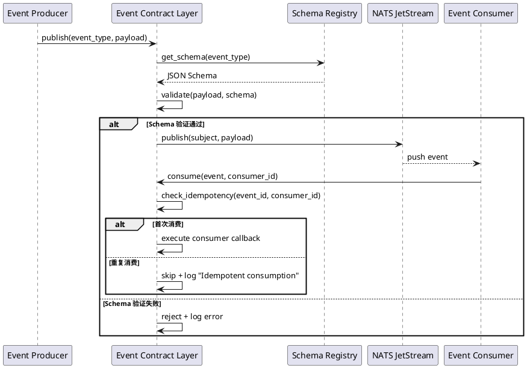
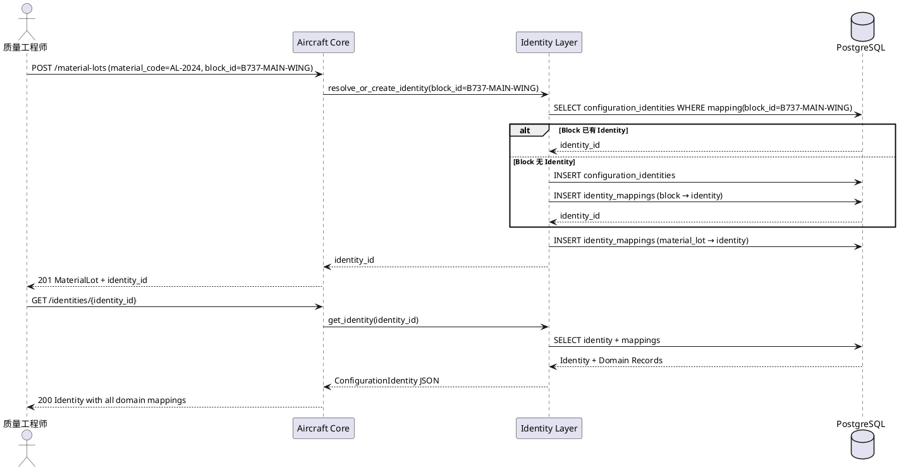
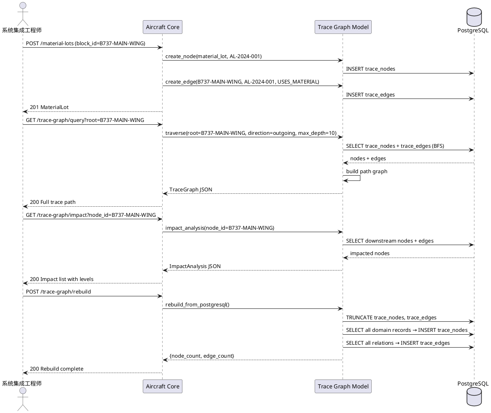
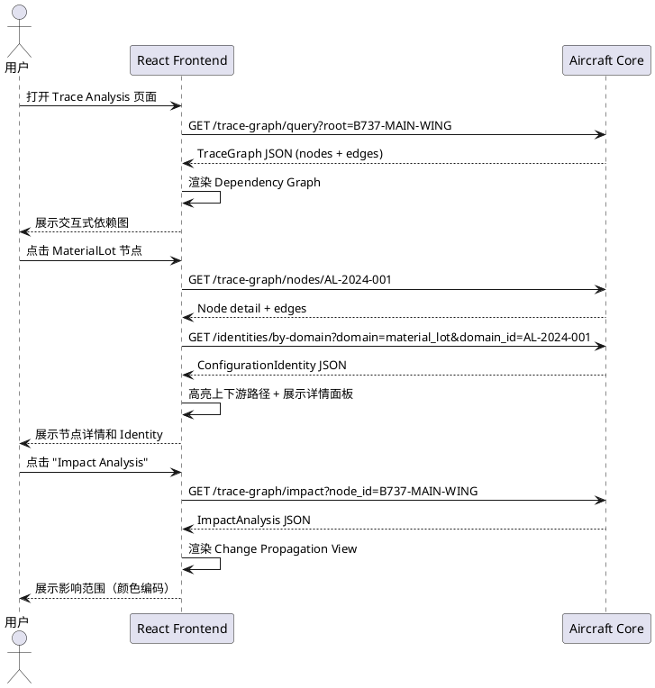

# AeroForge-X EV-4.6 Digital Thread Hardening — 需求规格文档

**项目**: AeroForge-X v6.0 "Project Valkyrie"  
**Sprint**: EV-4.6 Digital Thread Hardening Sprint  
**目标 TRL**: 6.5 → 7.0  
**日期**: 2026-06-22  
**状态**: DRAFT  
**前置基线**: EV-4.5 Digital Thread Foundation（PASS 级验收通过，Material/Quality/Certification Thread 闭环运行）  
**核心原则**: 结构化加固，不是功能扩展

---

# 1. 组件定位

## 1.1 核心职责

本组件负责对 EV-4.5 已建立的 Digital Thread 进行三维度结构化加固——事件契约治理（Event Contract Layer）、身份统一（Identity Unification Layer）、追溯图模型（Trace Graph Model）——将系统从 CRUD + Trace UI 升级为 Digital Thread Graph System。

## 1.2 核心输入

1. **EV-4.5 已有事件**: MaterialLotCreated / NDTCompleted / CARCreated / CARClosed / EvidenceUploaded / ConfigurationChanged 共 6 个 Pydantic 事件类，当前无 schema registry、无版本控制、无消费幂等规范
2. **EV-4.5 已有领域 ID**: block_id / material_lot_id / ndt_record_id / car_id / evidence_id / requirement_id / compliance_id，各 ID 独立生成、无统一身份映射
3. **EV-4.5 已有追溯关系**: Block → MaterialLot → NDTRecord → CAR → Evidence → Compliance 的关系链，当前仅通过 PostgreSQL 外键和 JOIN 查询实现，无图遍历能力
4. **EV-4.5 已有 React Trace 页面**: ConfigurationTracePage / MaterialTracePage / QualityTracePage / CertificationTracePage，当前为展示型页面，无依赖图、影响分析、变更传播视图
5. **PostgreSQL 16 已有表结构**: material_lots / ndt_records / corrective_actions / compliance_requirements / evidences / block_materials / compliance_evidences

## 1.3 核心输出

1. **Event Contract Layer**: event-contract/ 目录（schema/ versioning/ registry/），事件契约化治理体系，含 schema registry、语义化版本控制、消费幂等规范
2. **Identity Unification Layer**: ConfigurationIdentity 统一身份体系，1 Identity → N Domain Records 映射，跨域身份对齐
3. **Trace Graph Model**: in-memory / relational graph model（node / edge / traversal API），支持 TraceQuery 全链路路径查询
4. **Trace Analysis UI**: 从展示型升级为分析型的 React 追溯页面，含 dependency graph / impact analysis / change propagation view

## 1.4 职责边界

- **不负责**: NATS 扩展（不新增 JetStream stream、不新增 consumer group）
- **不负责**: Neo4j 引入（暂禁止，Trace Graph 使用 in-memory / relational 实现）
- **不负责**: MinIO 扩展（不新增 bucket、不扩展存储策略）
- **不负责**: Physics Twin 扩展（不新增仿真、不实现 DigitalTwinSyncEvent 同步逻辑）
- **不负责**: 新增微服务、新增数据库、新增 Docker 容器
- **不负责**: 生产级安全加固（认证鉴权、TLS、RBAC 属于 EV-5 范畴）
- **不负责**: 外部系统集成（ERP/MES/PLM 接口属于后续 Sprint）
- **核心约束**: 只做把当前数字线程"结构化成图" + 加入"事件契约治理层"

---

# 2. 领域术语

**Event Contract（事件契约）**
: 定义事件的数据结构、发布条件、消费语义、版本兼容性的正式规范，由 schema（JSON Schema）、version（语义化版本号）、registry（注册中心）三部分组成。

**Schema Registry（Schema 注册中心）**
: 存储和管理所有事件契约 schema 的中心化服务，提供 schema 注册、查询、版本对比、兼容性校验能力。

**Event Version（事件版本）**
: 事件契约的语义化版本号（major.minor.patch），major 变更表示 breaking change，minor 变更表示 backward-compatible 新增字段，patch 变更表示文档修正。

**Consumer Idempotency Key（消费幂等键）**
: 事件消费方用于确保重复消费不会产生副作用的唯一标识，由 event_id + consumer_id 组合生成。

**ConfigurationIdentity（配置统一身份）**
: 跨域统一身份标识，作为 system-of-record 将 block / material / quality / certification 四个域的记录映射到同一身份，实现跨系统对齐。

**Identity Mapping（身份映射）**
: 1 ConfigurationIdentity → N Domain Records 的映射关系，每个 Domain Record 属于一个域（block / material / quality / certification）并持有域内唯一 ID。

**Trace Graph（追溯图）**
: 以 node（实体）和 edge（关系）表示的数字线程图模型，支持 traversal（遍历）、dependency query（依赖查询）、impact analysis（影响分析）等图操作。

**Trace Node（追溯节点）**
: 图模型中的实体节点，包含 node_id、node_type（block / material_lot / ndt_record / car / evidence / compliance_requirement）、label、properties。

**Trace Edge（追溯边）**
: 图模型中的关系边，包含 edge_id、source_node_id、target_node_id、edge_type（USES_MATERIAL / TESTED_BY / HAS_CAR / EVIDENCE_FOR / COMPLIANCE_FOR）、properties。

**Trace Traversal（追溯遍历）**
: 从指定起点节点出发，沿 edge 关系进行 BFS/DFS 遍历，返回全链路路径的图操作。

**Impact Analysis（影响分析）**
: 给定一个节点，分析其下游所有依赖节点和影响范围的操作，回答"变更这个节点会影响哪些下游节点"。

**Change Propagation View（变更传播视图）**
: 在 React 前端以可视化方式展示变更影响范围的图形视图，包含节点高亮、路径标注、影响级别颜色编码。

---

# 3. 角色与边界

## 3.1 核心角色

- **质量工程师**: 负责在 Trace Analysis UI 中查看材料追溯链的影响分析和变更传播视图
- **适航工程师**: 负责在 Trace Analysis UI 中查看适航合规链的依赖图和影响范围
- **制造工程师**: 负责在 Trace Analysis UI 中查看 Block 配置变更对下游材料和质量的传播影响
- **系统集成工程师**: 负责验证 Event Contract Layer 的契约治理、Identity Unification 的跨域映射、Trace Graph 的全链路遍历
- **事件生产者（系统角色）**: Aircraft Core Service 中发布事件的业务代码，需遵循 Event Contract 规范
- **事件消费方（系统角色）**: 未来接入的下游服务或当前 InMemoryEventBus 回调，需遵循消费幂等规范

## 3.2 外部系统

- **Aircraft Core Service (FastAPI, port 8001)**: 扩展 Event Contract Layer / Identity Unification Layer / Trace Graph Model 业务逻辑
- **React Frontend (port 80)**: Trace Analysis UI 页面，升级展示型页面为分析型
- **PostgreSQL 16 (port 5432)**: 新增 configuration_identities / identity_mappings / trace_nodes / trace_edges 表
- **NATS JetStream (port 4222/8222)**: 复用现有 JetStream，不新增 stream 或 consumer group

## 3.3 交互上下文



---

# 4. DFX约束

## 4.1 性能

- **DH-NFR-01**: The system shall complete Trace Graph traversal query (TraceQuery for a single root node with up to 50 nodes and 80 edges) within 3 seconds
- **DH-NFR-02**: The system shall complete Identity Mapping resolution (1 ConfigurationIdentity → N Domain Records) within 500 milliseconds
- **DH-NFR-03**: The system shall complete Event Contract schema validation (single event payload against JSON Schema) within 100 milliseconds
- **DH-NFR-04**: The system shall complete Impact Analysis query (from a single node, max depth 5) within 5 seconds
- **DH-NFR-05**: The system shall complete React Trace Analysis UI initial load within 3 seconds on the deployment server
- **DH-NFR-06**: The system shall complete Trace Graph full-path query (B737-MAIN-WING → Material → Quality → Certification) within 5 seconds

## 4.2 可靠性

- **DH-NFR-07**: When Trace Graph in-memory model 与 PostgreSQL 数据不一致, the system shall 提供显式 rebuild 操作从 PostgreSQL 重建图模型，不自动静默修复
- **DH-NFR-08**: When Event Contract schema registry 查询失败, the system shall 降级为本地缓存 schema 继续验证，记录 WARNING 日志
- **DH-NFR-09**: The system shall ensure Identity Mapping 的 1:N 关系在并发创建时不产生重复映射记录（使用 UPSERT 策略）
- **DH-NFR-10**: When Trace Graph traversal 超过 max_depth 限制, the system shall 截断遍历并返回部分结果，标注 "truncated_at_depth"，不抛出异常

## 4.3 安全性

- **DH-NFR-11**: The system shall not expose Trace Graph internal node/edge IDs 到外部 API 响应中——外部 API 使用 ConfigurationIdentity 作为唯一标识
- **DH-NFR-12**: The system shall validate all Event Contract schema files against JSON Schema Draft 2020-12 规范，拒绝不合规的 schema 注册
- **DH-NFR-13**: The system shall restrict Trace Graph rebuild 操作为管理级 API（POST /api/v6/aircraft-core/trace-graph/rebuild），不暴露到前端

## 4.4 可维护性

- **DH-NFR-14**: The system shall output structured logs (JSON format) for all Event Contract operations including schema registration, version validation, idempotency check
- **DH-NFR-15**: The system shall output structured logs (JSON format) for all Trace Graph operations including node/edge creation, traversal, rebuild
- **DH-NFR-16**: The system shall expose all new API endpoints under the existing `/api/v6/aircraft-core` prefix with consistent response format
- **DH-NFR-17**: The system shall implement Trace Graph model behind abstract interface (TraceGraphRepository)，允许 in-memory / relational / future Neo4j 实现切换

## 4.5 兼容性

- **DH-NFR-18**: The system shall preserve all EV-4.5 API endpoints without regression
- **DH-NFR-19**: The system shall use the existing PostgreSQL database (aeroforge) for all new tables, not create additional databases
- **DH-NFR-20**: The system shall use the existing docker-compose infrastructure, not add new containers or services
- **DH-NFR-21**: The system shall ensure Event Contract v1.0.0 schema 与 EV-4.5 已有事件 payload 完全兼容（向后兼容）
- **DH-NFR-22**: The system shall ensure Identity Unification Layer 不破坏 EV-4.5 已有的 block_id / material_lot_id / ndt_record_id 等域 ID 的使用方式

---

# 5. 核心能力

## 5.1 Sprint-H01: Event Contract Layer

### 5.1.1 业务规则

1. **DH-REQ-01**: When 系统定义或更新事件契约, the system shall 将事件契约 schema 以 JSON Schema Draft 2020-12 格式存储到 `event-contract/schema/` 目录

   a. 验收条件: [event-contract/schema/ 目录] → [包含 MaterialLotCreated.json / NDTCompleted.json / CARCreated.json / CARClosed.json / EvidenceUploaded.json / ConfigurationChanged.json 共 6 个 schema 文件，每个文件通过 JSON Schema Draft 2020-12 验证器校验通过]

2. **DH-REQ-02**: When 事件生产者发布事件, the Event Contract Layer shall 在发布前验证事件 payload 是否符合对应事件契约的 schema 定义，不符合则拒绝发布并记录错误日志

   a. 验收条件: [发布一个缺少必填字段的事件 payload] → [事件发布被拒绝，日志记录 Schema 验证失败详情，HTTP 响应不受影响（事件发布为 fire-and-forget）]

3. **DH-REQ-03**: When 事件契约需要变更, the system shall 使用语义化版本号（major.minor.patch）管理契约版本，存储在 `event-contract/versioning/` 目录

   a. 验收条件: [event-contract/versioning/ 目录] → [包含 version-manifest.json 文件，记录每个事件契约的当前版本号，初始版本均为 1.0.0]

4. **DH-REQ-04**: When 事件契约发生 major 版本变更, the Event Contract Layer shall 标记该变更为 breaking change 并要求所有消费方确认兼容性

   a. 验收条件: [将 MaterialLotCreated schema 的必填字段变更为新增字段并升级 major 版本] → [version-manifest.json 中 MaterialLotCreated 版本为 2.0.0，breaking_change 标记为 true]

5. **DH-REQ-05**: When 事件契约发生 minor 版本变更, the Event Contract Layer shall 确保变更向后兼容——新增字段必须有默认值，不删除已有字段

   a. 验收条件: [在 MaterialLotCreated schema 中新增可选字段 "batch_no" 并升级 minor 版本] → [version-manifest.json 中版本为 1.1.0，旧版消费方仍可正常消费不含 batch_no 字段的事件]

6. **DH-REQ-06**: The system shall 提供 Schema Registry API（GET /api/v6/aircraft-core/event-contracts），支持查询所有已注册事件契约的 schema 和版本信息

   a. 验收条件: [GET /event-contracts 请求] → [返回包含所有事件契约名称、当前版本、schema URL 的列表]

7. **DH-REQ-07**: The system shall 提供 Schema Registry 单事件查询 API（GET /api/v6/aircraft-core/event-contracts/{event_type}），支持查询指定事件契约的完整 schema

   a. 验收条件: [GET /event-contracts/MaterialLotCreated 请求] → [返回 MaterialLotCreated 的完整 JSON Schema + version + breaking_change 标记]

8. **DH-REQ-08**: When 事件消费方消费事件, the Event Contract Layer shall 为每个消费事件生成 Consumer Idempotency Key（event_id + consumer_id 组合），确保同一事件被同一消费方重复消费时不产生副作用

   a. 验收条件: [消费方使用相同 consumer_id 重复消费同一 event_id 的事件] → [第二次消费被识别为重复，日志记录 "Idempotent consumption detected"，不执行业务逻辑]

9. **DH-REQ-09**: When 系统启动, the Event Contract Layer shall 自动加载 `event-contract/schema/` 目录下所有 schema 文件到内存 registry，并校验 schema 合法性

   a. 验收条件: [启动 Aircraft Core Service] → [日志记录 "Loaded N event contract schemas into registry"，N = 6]

10. **禁止项**: The system shall NOT 在 Event Contract Layer 中实现事件的持久化存储或重放能力——事件持久化由 NATS JetStream 负责

    a. 验收条件: [代码审查] → [EventContractLayer 中不存在事件持久化或重放相关代码]

### 5.1.2 交互流程



### 5.1.3 异常场景

1. **Schema 文件缺失**

   a. 触发条件: [event-contract/schema/ 目录中缺少某个事件类型的 schema 文件]
   
   b. 系统行为: [启动时记录 WARNING 日志 "Schema not found for event type: {event_type}"，该事件类型跳过 schema 验证，事件可正常发布]
   
   c. 用户感知: [日志中有 WARNING，事件发布不受阻断]

2. **Schema 验证失败但事件发布不可阻断**

   a. 触发条件: [事件 payload 不符合 schema，但事件发布为 fire-and-forget 模式]
   
   b. 系统行为: [记录 ERROR 日志 "Event payload schema validation failed: {details}"，事件仍发布到 NATS，不阻断业务请求]
   
   c. 用户感知: [业务请求正常返回，但日志中有 schema 验证失败的 ERROR 记录]

3. **Version manifest 文件损坏**

   a. 触发条件: [event-contract/versioning/version-manifest.json 文件格式错误或不存在]
   
   b. 系统行为: [启动时创建默认 version-manifest.json（所有事件版本 1.0.0），记录 WARNING 日志]
   
   c. 用户感知: [系统正常启动，所有事件契约版本重置为 1.0.0]

---

## 5.2 Sprint-H02: Identity Unification Layer

### 5.2.1 业务规则

1. **DH-REQ-10**: When 创建任何域记录（Block / MaterialLot / NDTRecord / CAR / Evidence / ComplianceRequirement）, the Identity Unification Layer shall 自动创建或关联一个 ConfigurationIdentity，确保每个域记录都有对应的统一身份

   a. 验收条件: [POST /material-lots 创建 MaterialLot AL-2024-001] → [configuration_identities 表中自动创建一条 ConfigurationIdentity 记录，identity_mappings 表中创建 MaterialLot → ConfigurationIdentity 的映射]

2. **DH-REQ-11**: When 查询 ConfigurationIdentity, the system shall 返回该统一身份关联的所有域记录信息，形成 1 Identity → N Domain Records 的完整映射

   a. 验收条件: [GET /api/v6/aircraft-core/identities/{identity_id} 请求] → [返回包含 identity_id、created_at、mappings 数组的 JSON，mappings 中包含 block_id / material_lot_id / ndt_record_id 等所有关联的域记录]

3. **DH-REQ-12**: When 通过域记录 ID 反查 ConfigurationIdentity, the system shall 返回该域记录对应的统一身份 ID

   a. 验收条件: [GET /api/v6/aircraft-core/identities/by-domain?domain=material_lot&domain_id=AL-2024-001 请求] → [返回对应的 ConfigurationIdentity JSON]

4. **DH-REQ-13**: When 已有关联关系的域记录需要绑定到同一 ConfigurationIdentity, the Identity Unification Layer shall 支持通过 identity_id 将新的域记录映射到已有统一身份

   a. 验收条件: [创建 NDTRecord 时指定 identity_id 关联到已有 ConfigurationIdentity] → [identity_mappings 表中新增 NDTRecord → 该 ConfigurationIdentity 的映射，不创建新的 ConfigurationIdentity]

5. **DH-REQ-14**: When Block 和 MaterialLot 已通过 block_materials 关联表建立关系, the Identity Unification Layer shall 自动将它们映射到同一 ConfigurationIdentity

   a. 验收条件: [POST /material-lots 请求包含 block_id=B737-MAIN-WING] → [如果 B737-MAIN-WING 已有 ConfigurationIdentity，则 MaterialLot 映射到同一 ConfigurationIdentity；否则创建新的 ConfigurationIdentity 并同时映射 Block 和 MaterialLot]

6. **DH-REQ-15**: When MaterialLot 和 NDTRecord 已通过外键关联, the Identity Unification Layer shall 自动将 NDTRecord 映射到与 MaterialLot 相同的 ConfigurationIdentity

   a. 验收条件: [POST /ndt-records 请求包含 material_lot_id=AL-2024-001] → [NDTRecord 映射到 AL-2024-001 所在的同一 ConfigurationIdentity]

7. **DH-REQ-16**: The system shall 提供 Identity Query API（GET /api/v6/aircraft-core/identities），支持按域类型和域 ID 查询 ConfigurationIdentity 列表

   a. 验收条件: [GET /identities?domain=material_lot 请求] → [返回所有包含 material_lot 类型映射的 ConfigurationIdentity 列表]

8. **DH-REQ-17**: When 删除 ConfigurationIdentity, the system shall 拒绝删除操作——ConfigurationIdentity 为不可变记录，只增不删

   a. 验收条件: [尝试 DELETE /identities/{identity_id}] → [返回 HTTP 405 Method Not Allowed]

9. **禁止项**: The system shall NOT 在 Identity Unification Layer 中修改已有域记录的 ID——Identity Layer 只做映射，不改变域记录的原始标识

   a. 验收条件: [代码审查] → [IdentityUnificationLayer 中不存在修改 block_id / material_lot_id / ndt_record_id 等域 ID 的代码]

### 5.2.2 交互流程



### 5.2.3 异常场景

1. **域记录 ID 不存在**

   a. 触发条件: [GET /identities/by-domain?domain=material_lot&domain_id=NONEXISTENT 请求]
   
   b. 系统行为: [返回 HTTP 404 Not Found]
   
   c. 用户感知: [错误提示 "No identity mapping found for domain record"]

2. **ConfigurationIdentity 不存在**

   a. 触发条件: [GET /identities/{identity_id} 请求的 identity_id 不存在]
   
   b. 系统行为: [返回 HTTP 404 Not Found]
   
   c. 用户感知: [错误提示 "ConfigurationIdentity not found"]

3. **并发创建同一域记录的 Identity**

   a. 触发条件: [两个并发请求同时为同一 block_id 创建 ConfigurationIdentity]
   
   b. 系统行为: [使用 UPSERT 策略（INSERT ON CONFLICT DO NOTHING），确保只创建一个 ConfigurationIdentity，第二个请求关联到已有的 Identity]
   
   c. 用户感知: [两个请求均正常返回，共享同一 ConfigurationIdentity]

4. **域记录无关联关系时创建独立 Identity**

   a. 触发条件: [POST /material-lots 请求不包含 block_id]
   
   b. 系统行为: [创建新的独立 ConfigurationIdentity，仅映射 MaterialLot]
   
   c. 用户感知: [MaterialLot 拥有独立的 ConfigurationIdentity，后续可通过 PATCH 关联到其他 Identity]

---

## 5.3 Sprint-H03: Trace Graph Model

### 5.3.1 业务规则

1. **DH-REQ-18**: When 创建域记录（Block / MaterialLot / NDTRecord / CAR / Evidence / ComplianceRequirement）, the Trace Graph Model shall 自动创建对应的 Trace Node 并持久化到 PostgreSQL

   a. 验收条件: [POST /material-lots 创建 MaterialLot AL-2024-001] → [trace_nodes 表中自动创建一条 node_type="material_lot"、label="AL-2024-001" 的 Trace Node]

2. **DH-REQ-19**: When 域记录之间建立关联关系（Block→MaterialLot / MaterialLot→NDTRecord / NDTRecord→CAR / Evidence→ComplianceRequirement）, the Trace Graph Model shall 自动创建对应的 Trace Edge 并持久化到 PostgreSQL

   a. 验收条件: [POST /material-lots 请求包含 block_id=B737-MAIN-WING] → [trace_edges 表中自动创建 source_node_id=B737-MAIN-WING、target_node_id=AL-2024-001、edge_type="USES_MATERIAL" 的 Trace Edge]

3. **DH-REQ-20**: When 用户发起 TraceQuery 查询, the Trace Graph Model shall 从指定起点节点出发，沿 edge 关系进行 BFS 遍历，返回全链路路径

   a. 验收条件: [GET /api/v6/aircraft-core/trace-graph/query?root=B737-MAIN-WING 请求] → [返回包含所有可达节点和边的 JSON，形成 B737-MAIN-WING → AL-2024-001 → NDT-001 → CAR-001 → Evidence → Compliance 的完整路径]

4. **DH-REQ-21**: When 用户发起 Impact Analysis 查询, the Trace Graph Model shall 从指定节点出发，沿 edge 关系向下游遍历，返回所有受影响节点及其影响级别

   a. 验收条件: [GET /api/v6/aircraft-core/trace-graph/impact?node_id=B737-MAIN-WING 请求] → [返回包含所有下游节点（MaterialLot / NDTRecord / CAR / Evidence / Compliance）的列表，每个节点标注 impact_level（direct / indirect）]

5. **DH-REQ-22**: When 用户发起 Dependency Query 查询, the Trace Graph Model shall 从指定节点出发，沿 edge 关系向上游遍历，返回所有依赖节点

   a. 验收条件: [GET /api/v6/aircraft-core/trace-graph/dependencies?node_id=CAR-001 请求] → [返回包含所有上游节点（NDTRecord → MaterialLot → Block）的列表]

6. **DH-REQ-23**: The system shall 提供 Trace Graph Rebuild API（POST /api/v6/aircraft-core/trace-graph/rebuild），从 PostgreSQL 已有业务数据重建完整的 Trace Graph（node + edge）

   a. 验收条件: [POST /trace-graph/rebuild 请求] → [trace_nodes 和 trace_edges 表被清空并从 block_configurations / material_lots / ndt_records / corrective_actions / evidences / compliance_requirements 表重建，返回重建的 node_count 和 edge_count]

7. **DH-REQ-24**: When Trace Graph traversal 深度超过 max_depth 参数（默认 10）, the system shall 截断遍历并返回部分结果，标注 truncated_at_depth 信息

   a. 验收条件: [TraceQuery 请求 max_depth=3 且实际链路深度超过 3] → [返回截断的部分路径，响应中包含 "truncated_at_depth": 3]

8. **DH-REQ-25**: When Trace Graph 中存在环路, the system shall 检测并跳过已访问节点，避免无限循环

   a. 验收条件: [Trace Graph 中存在 A→B→C→A 环路时发起 TraceQuery] → [遍历正常完成，每个节点只访问一次，不进入无限循环]

9. **DH-REQ-26**: The system shall 提供 Trace Node 查询 API（GET /api/v6/aircraft-core/trace-graph/nodes/{node_id}），返回指定节点的详细信息和关联边

   a. 验收条件: [GET /trace-graph/nodes/AL-2024-001 请求] → [返回 node_id、node_type、label、properties、incoming_edges、outgoing_edges 的完整信息]

10. **DH-REQ-27**: The system shall 提供 Trace Graph 统计 API（GET /api/v6/aircraft-core/trace-graph/stats），返回当前图模型的节点数、边数、节点类型分布

    a. 验收条件: [GET /trace-graph/stats 请求] → [返回 {"node_count": N, "edge_count": M, "node_types": {"block": X, "material_lot": Y, ...}}]

11. **DH-REQ-28**: When 域记录被更新（如 MaterialLot 状态变更）, the Trace Graph Model shall 更新对应 Trace Node 的 properties 字段

    a. 验收条件: [MaterialLot AL-2024-001 的 status 从 "received" 变更为 "inspected"] → [trace_nodes 中对应节点的 properties 字段更新为 {"status": "inspected"}]

12. **禁止项**: The system shall NOT 在 Trace Graph Model 中引入 Neo4j 或任何图数据库——当前使用 in-memory + PostgreSQL relational 实现

    a. 验收条件: [代码审查] → [Trace Graph 实现中不存在 neo4j driver import 或 Cypher 查询语句]

13. **禁止项**: The system shall NOT 在 Trace Graph Model 中存储域记录的完整业务数据——Trace Node 的 properties 仅存储摘要信息（如 status / result），完整数据通过域 API 查询

    a. 验收条件: [trace_nodes 表的 properties 字段] → [不包含 material_name / supplier_id / description 等完整业务字段，仅包含 status / result 等摘要字段]

### 5.3.2 交互流程



### 5.3.3 异常场景

1. **TraceQuery 起点节点不存在**

   a. 触发条件: [GET /trace-graph/query?root=NONEXISTENT 请求]
   
   b. 系统行为: [返回 HTTP 404 Not Found]
   
   c. 用户感知: [错误提示 "Trace node not found: NONEXISTENT"]

2. **Trace Graph 与业务数据不一致**

   a. 触发条件: [trace_nodes 中缺少某个 MaterialLot 对应的 node]
   
   b. 系统行为: [TraceQuery 返回不完整路径，缺失节点不出现；用户可通过 POST /trace-graph/rebuild 重建]
   
   c. 用户感知: [追溯链路不完整，rebuild 后恢复完整]

3. **Rebuild 过程中业务数据写入**

   a. 触发条件: [执行 POST /trace-graph/rebuild 时有新的 MaterialLot 被创建]
   
   b. 系统行为: [Rebuild 在事务中执行，新创建的 MaterialLot 在 rebuild 完成后通过正常 create_node 流程写入，不丢失]
   
   c. 用户感知: [Rebuild 完成后图模型完整，包含 rebuild 期间新增的数据]

4. **Impact Analysis 无下游节点**

   a. 触发条件: [GET /trace-graph/impact?node_id=CAR-001 请求，CAR 为叶子节点无下游]
   
   b. 系统行为: [返回空 impacted_nodes 数组，HTTP 200]
   
   c. 用户感知: [响应体 impacted_nodes 为空数组，表示无下游影响]

5. **Traversal 超时**

   a. 触发条件: [Trace Graph 节点数超过 1000 且 traversal 未在 10 秒内完成]
   
   b. 系统行为: [返回已遍历的部分结果，标注 "timeout": true，不抛出异常]
   
   c. 用户感知: [返回部分追溯路径，包含超时提示]

---

## 5.4 Sprint-H04: Trace Analysis UI

### 5.4.1 业务规则

1. **DH-REQ-29**: When 用户打开 Trace Analysis 页面, the React Frontend shall 展示 Trace Graph 的交互式依赖图（Dependency Graph），节点可拖拽、可缩放、可点击

   a. 验收条件: [浏览器访问 Trace Analysis 页面] → [页面展示 B737-MAIN-WING → AL-2024-001 → NDT-001 → CAR-001 → Evidence → Compliance 的依赖图，节点可拖拽，画布可缩放]

2. **DH-REQ-30**: When 用户在 Dependency Graph 中点击某个节点, the React Frontend shall 高亮该节点的所有上下游路径，并在侧面板展示节点详情和关联的 ConfigurationIdentity

   a. 验收条件: [点击 MaterialLot 节点 AL-2024-001] → [上游 Block 和下游 NDT/CAR 路径高亮，侧面板展示 lot_id / material_code / status / identity_id]

3. **DH-REQ-31**: When 用户在 Trace Analysis 页面触发 Impact Analysis, the React Frontend shall 展示变更传播视图（Change Propagation View），以颜色编码标注影响级别

   a. 验收条件: [选择 Block 节点 B737-MAIN-WING 并点击 "Impact Analysis"] → [页面展示所有下游受影响节点，direct impact 节点为红色，indirect impact 节点为橙色，未受影响节点为灰色]

4. **DH-REQ-32**: When 用户在 Trace Analysis 页面搜索节点, the React Frontend shall 支持按 node_type 和 label 进行搜索过滤

   a. 验收条件: [在搜索框输入 "AL-2024"] → [Dependency Graph 中高亮匹配的 MaterialLot 节点，其他节点淡化]

5. **DH-REQ-33**: When Trace Graph API 返回截断结果（truncated_at_depth）, the React Frontend shall 在依赖图中标注截断位置，并提供 "Load More" 操作继续加载

   a. 验收条件: [TraceQuery 返回 truncated_at_depth=3 的结果] → [依赖图在深度 3 处显示 "..." 标识和 "Load More" 按钮]

6. **DH-REQ-34**: When 用户查看 ConfigurationIdentity 详情, the React Frontend shall 展示该 Identity 关联的所有域记录，以跨域对齐视图呈现

   a. 验收条件: [点击 Identity 面板] → [展示 Block / Material / Quality / Certification 四个域的记录列表，每个域记录可点击跳转到对应详情]

7. **DH-REQ-35**: When API 请求失败或返回空数据, the React Frontend shall 展示友好的空状态或错误提示，不显示空白页面

   a. 验收条件: [Trace Graph API 返回空 nodes 数组] → [页面展示 "暂无追溯数据" 空状态提示]

### 5.4.2 交互流程



### 5.4.3 异常场景

1. **Trace Graph API 不可用**

   a. 触发条件: [React 前端请求 Trace Graph API 时 Aircraft Core 返回 5xx 或网络超时]
   
   b. 系统行为: [前端展示错误提示 "追溯图服务暂时不可用，请稍后重试"，提供重试按钮]
   
   c. 用户感知: [页面展示错误状态而非空白]

2. **依赖图渲染节点过多**

   a. 触发条件: [TraceQuery 返回超过 200 个节点]
   
   b. 系统行为: [前端展示性能警告 "节点数量较多，可能影响渲染性能"，提供缩放和过滤操作]
   
   c. 用户感知: [页面正常渲染但显示性能提示]

3. **Impact Analysis 无结果**

   a. 触发条件: [对叶子节点执行 Impact Analysis]
   
   b. 系统行为: [前端展示 "该节点无下游影响" 提示]
   
   c. 用户感知: [页面展示空影响提示，依赖图不变]

---

# 6. 数据约束

## 6.1 ConfigurationIdentity

1. **identity_id**: 必填，UUID 格式，系统自动生成，全局唯一
2. **created_at**: 必填，ISO 8601 格式，创建时间，系统自动填充
3. **updated_at**: 必填，ISO 8601 格式，更新时间，系统自动维护

## 6.2 IdentityMapping

1. **mapping_id**: 必填，UUID 格式，系统自动生成，全局唯一
2. **identity_id**: 必填，关联 ConfigurationIdentity.identity_id，外键约束
3. **domain**: 必填，枚举值之一: "block" / "material_lot" / "ndt_record" / "car" / "evidence" / "compliance_requirement"
4. **domain_id**: 必填，对应域记录的主键值，如 "B737-MAIN-WING" / "AL-2024-001"
5. **mapped_at**: 必填，ISO 8601 格式，映射时间，系统自动填充
6. **唯一约束**: (domain, domain_id) 组合唯一——同一域记录只能映射到一个 ConfigurationIdentity

## 6.3 TraceNode

1. **node_id**: 必填，字符串，对应域记录的主键值（如 "B737-MAIN-WING" / "AL-2024-001"），全局唯一
2. **node_type**: 必填，枚举值之一: "block" / "material_lot" / "ndt_record" / "car" / "evidence" / "compliance_requirement"
3. **label**: 必填，非空字符串，节点显示标签（如 "B737-MAIN-WING" / "AL-2024-001"）
4. **properties**: 可选，JSON 对象，节点摘要属性（如 {"status": "inspected", "result": "conditional"}），不存储完整业务数据
5. **identity_id**: 可选，关联 ConfigurationIdentity.identity_id
6. **created_at**: 必填，ISO 8601 格式，创建时间
7. **updated_at**: 必填，ISO 8601 格式，更新时间

## 6.4 TraceEdge

1. **edge_id**: 必填，UUID 格式，系统自动生成，全局唯一
2. **source_node_id**: 必填，关联 TraceNode.node_id，外键约束
3. **target_node_id**: 必填，关联 TraceNode.node_id，外键约束
4. **edge_type**: 必填，枚举值之一: "USES_MATERIAL" / "TESTED_BY" / "HAS_CAR" / "EVIDENCE_FOR" / "COMPLIANCE_FOR" / "CONTAINS_BLOCK"
5. **properties**: 可选，JSON 对象，边属性
6. **created_at**: 必填，ISO 8601 格式，创建时间
7. **唯一约束**: (source_node_id, target_node_id, edge_type) 组合唯一——同一对节点之间同类型边只允许一条

## 6.5 EventContractVersion

1. **event_type**: 必填，非空字符串，事件类型名称，如 "MaterialLotCreated"，全局唯一
2. **version**: 必填，语义化版本号格式（major.minor.patch），如 "1.0.0"
3. **breaking_change**: 必填，布尔值，标记当前版本是否为 breaking change
4. **schema_path**: 必填，非空字符串，对应 schema 文件的相对路径
5. **registered_at**: 必填，ISO 8601 格式，注册时间

## 6.6 ConsumerIdempotencyRecord

1. **event_id**: 必填，UUID 格式，事件唯一标识
2. **consumer_id**: 必填，非空字符串，消费方标识
3. **consumed_at**: 必填，ISO 8601 格式，首次消费时间
4. **唯一约束**: (event_id, consumer_id) 组合唯一——同一事件同一消费方只记录一次

---

# 7. 验收矩阵

## 7.1 PASS 级验收（必须通过）

| 需求编号 | 验收项 | 对应 Sprint |
|----------|--------|-------------|
| DH-REQ-01 | 6 个事件契约 schema 文件存储到 event-contract/schema/ | Sprint-H01 |
| DH-REQ-02 | 事件发布前 schema 验证 | Sprint-H01 |
| DH-REQ-03 | 事件契约语义化版本管理 | Sprint-H01 |
| DH-REQ-08 | Consumer Idempotency Key 幂等消费 | Sprint-H01 |
| DH-REQ-10 | 域记录创建时自动关联 ConfigurationIdentity | Sprint-H02 |
| DH-REQ-11 | 查询 ConfigurationIdentity 返回所有域记录映射 | Sprint-H02 |
| DH-REQ-14 | Block 和 MaterialLot 自动映射到同一 Identity | Sprint-H02 |
| DH-REQ-18 | 域记录创建时自动创建 Trace Node | Sprint-H03 |
| DH-REQ-19 | 域记录关联时自动创建 Trace Edge | Sprint-H03 |
| DH-REQ-20 | TraceQuery 全链路路径查询 | Sprint-H03 |
| DH-REQ-23 | Trace Graph Rebuild 从 PostgreSQL 重建 | Sprint-H03 |

## 7.2 A 级验收（PASS + 分析能力）

| 需求编号 | 验收项 | 对应 Sprint |
|----------|--------|-------------|
| DH-REQ-04 | Major 版本变更 breaking change 标记 | Sprint-H01 |
| DH-REQ-05 | Minor 版本变更向后兼容 | Sprint-H01 |
| DH-REQ-06 | Schema Registry API 查询所有契约 | Sprint-H01 |
| DH-REQ-07 | Schema Registry 单事件查询 | Sprint-H01 |
| DH-REQ-12 | 通过域记录 ID 反查 ConfigurationIdentity | Sprint-H02 |
| DH-REQ-15 | MaterialLot 和 NDTRecord 自动映射到同一 Identity | Sprint-H02 |
| DH-REQ-21 | Impact Analysis 影响分析查询 | Sprint-H03 |
| DH-REQ-22 | Dependency Query 依赖查询 | Sprint-H03 |
| DH-REQ-25 | Trace Graph 环路检测 | Sprint-H03 |
| DH-REQ-26 | Trace Node 详情查询 | Sprint-H03 |
| DH-REQ-27 | Trace Graph 统计 API | Sprint-H03 |
| DH-REQ-28 | 域记录更新时 Trace Node properties 同步 | Sprint-H03 |

## 7.3 A+ 级验收（A + Trace Analysis UI）

| 需求编号 | 验收项 | 对应 Sprint |
|----------|--------|-------------|
| DH-REQ-29 | Trace Analysis 交互式依赖图 | Sprint-H04 |
| DH-REQ-30 | 节点点击高亮上下游路径 + Identity 面板 | Sprint-H04 |
| DH-REQ-31 | Change Propagation View 变更传播视图 | Sprint-H04 |
| DH-REQ-32 | 节点搜索过滤 | Sprint-H04 |
| DH-REQ-33 | 截断结果 Load More | Sprint-H04 |
| DH-REQ-34 | ConfigurationIdentity 跨域对齐视图 | Sprint-H04 |

## 7.4 最终验收场景（必须演示）

```
B737-000001 → MAIN-WING → AL-2024-001 → Supplier-A → NDT-001 → CAR-001 → Evidence-Package → FAA Compliance
```

**端到端验收步骤**:

1. **Event Contract**: GET /event-contracts → 返回 6 个事件契约 schema + 版本号
2. **Event Contract**: 发布事件 payload → schema 验证通过 → NATS 收到事件
3. **Identity**: POST /material-lots (block_id=B737-MAIN-WING) → MaterialLot 和 Block 映射到同一 ConfigurationIdentity
4. **Identity**: GET /identities/{identity_id} → 返回 Block + MaterialLot + NDT + CAR 全域映射
5. **Trace Graph**: POST /trace-graph/rebuild → 从 PostgreSQL 重建完整图模型
6. **Trace Graph**: GET /trace-graph/query?root=B737-MAIN-WING → 返回全链路路径
7. **Trace Graph**: GET /trace-graph/impact?node_id=B737-MAIN-WING → 返回所有下游受影响节点
8. **Trace Analysis UI**: 浏览器访问 Trace Analysis 页面 → 展示交互式依赖图 + Impact Analysis + Change Propagation View

**验收命令**:

```bash
# 1. 查询事件契约
curl http://localhost:8001/api/v6/aircraft-core/event-contracts
# 预期: 200, 返回 6 个事件契约列表

# 2. 查询单个事件契约
curl http://localhost:8001/api/v6/aircraft-core/event-contracts/MaterialLotCreated
# 预期: 200, 返回完整 JSON Schema + version 1.0.0

# 3. 创建材料批次（触发 Identity + Trace Graph）
curl -X POST http://localhost:8001/api/v6/aircraft-core/material-lots \
  -H "Content-Type: application/json" \
  -d '{"material_code": "AL-2024", "material_name": "Aluminum 2024-T3", "supplier_id": "Supplier-A", "block_id": "B737-MAIN-WING", "certificate_no": "CERT-2024-001"}'
# 预期: 201, lot_id = "AL-2024-001", identity_id 自动生成

# 4. 查询 Identity 映射
curl http://localhost:8001/api/v6/aircraft-core/identities/by-domain?domain=material_lot&domain_id=AL-2024-001
# 预期: 200, 返回 ConfigurationIdentity + 所有域映射

# 5. 重建 Trace Graph
curl -X POST http://localhost:8001/api/v6/aircraft-core/trace-graph/rebuild
# 预期: 200, { "node_count": N, "edge_count": M }

# 6. TraceQuery 全链路查询
curl "http://localhost:8001/api/v6/aircraft-core/trace-graph/query?root=B737-MAIN-WING"
# 预期: 200, 返回完整追溯路径

# 7. Impact Analysis
curl "http://localhost:8001/api/v6/aircraft-core/trace-graph/impact?node_id=B737-MAIN-WING"
# 预期: 200, 返回所有下游受影响节点

# 8. Trace Graph Stats
curl http://localhost:8001/api/v6/aircraft-core/trace-graph/stats
# 预期: 200, { "node_count": N, "edge_count": M, "node_types": {...} }

# 9. React Trace Analysis UI 验证
# 浏览器访问 http://8.210.239.214:6000/trace-analysis → 展示依赖图 + Impact Analysis
```

---

# 8. Sprint 依赖与执行顺序

```
Sprint-H01 (Event Contract Layer) ──────── P0 (独立，可先行)
    │
    ├──→ Sprint-H02 (Identity Unification) ── P0 (依赖 H01 的事件契约)
    │       │
    │       └──→ Sprint-H03 (Trace Graph Model) ── P0 (依赖 H02 的 Identity)
    │               │
    │               └──→ Sprint-H04 (Trace Analysis UI) ── P1 (依赖 H03 的 Graph API)
    │
    └──→ Sprint-H01 与 H02 可部分并行（H01 schema 定义完成后即可启动 H02）
```

**执行顺序建议**:
1. H01（Event Contract Layer）— 先行启动，建立事件契约治理体系
2. H02（Identity Unification Layer）— H01 schema 定义完成后启动，建立统一身份体系
3. H03（Trace Graph Model）— H02 Identity 映射完成后启动，构建追溯图模型
4. H04（Trace Analysis UI）— H03 Graph API 就绪后启动，升级前端为分析型

**关键依赖说明**:
- H01 → H02: Identity Layer 的事件需要遵循 Event Contract 规范
- H02 → H03: Trace Graph 的 node 需要关联 ConfigurationIdentity
- H03 → H04: Trace Analysis UI 需要 Trace Graph API 提供数据

**与 EV-4.5 的关系**:
- EV-4.5 提供了 Material/Quality/Certification Thread 的 CRUD 基础
- EV-4.6 在此基础上进行结构化加固，不修改 EV-4.5 的 API 契约
- EV-4.6 新增的表（configuration_identities / identity_mappings / trace_nodes / trace_edges / consumer_idempotency_records）与 EV-4.5 已有表共存，不修改已有表结构

---

# 9. 与 EV-4.5 Digital Thread Foundation 的关系

本 Sprint 是 EV-4.5 Digital Thread Foundation 的结构化加固延续：

| EV-4.5 已有能力 | EV-4.6 加固方向 | 加固目标 |
|-----------------|----------------|----------|
| 6 个 Pydantic 事件类（无 schema registry） | Event Contract Layer | 事件契约化治理、版本控制、消费幂等 |
| 4 种域 ID 独立生成（无统一身份） | Identity Unification Layer | 跨域身份对齐、1:N 映射 |
| PostgreSQL JOIN 查询追溯（无图遍历） | Trace Graph Model | 图遍历、影响分析、依赖查询 |
| 展示型 React Trace 页面 | Trace Analysis UI | 依赖图、变更传播视图、分析型 |

**核心原则验证**: EV-4.6 的每个加固方向都由 EV-4.5 大G项目经理指出的 3 个关键风险驱动——Event Bus 契约治理、身份体系统一、追溯分析能力。